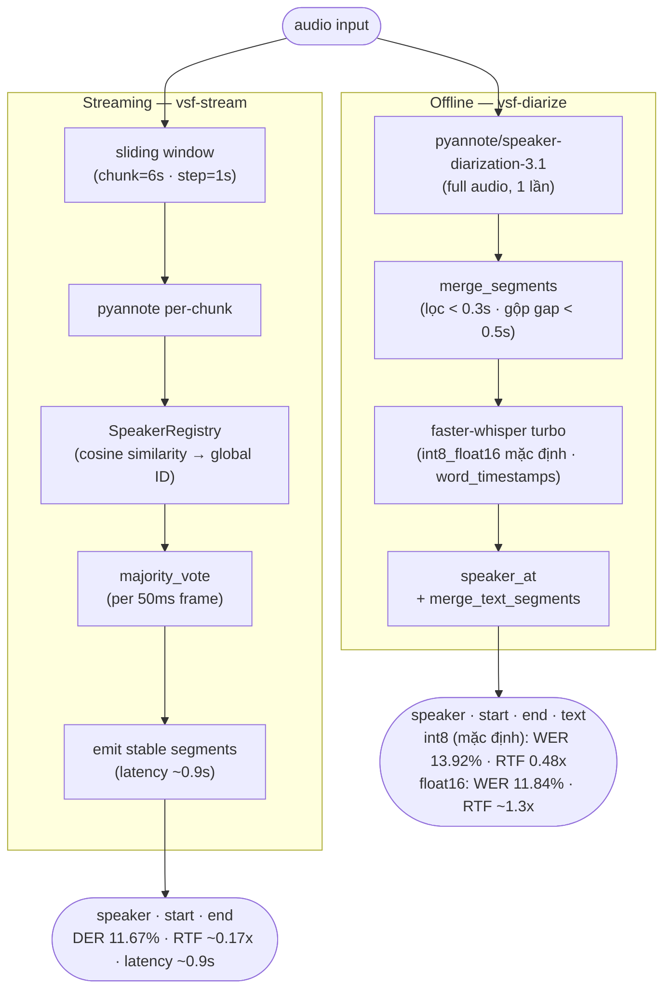

# Vietnamese Speech Diarization & ASR

Pipeline nhận dạng giọng nói + phân biệt người nói (speaker diarization) cho tiếng Việt.  
Chạy trên GPU CUDA (NVIDIA GTX 1650+) hoặc CPU.

[](https://github.com/GolDDragon1702/vsf_diarization/actions/workflows/ci.yml)

---

## Kết quả nhanh

| Metric | Giá trị |
|--------|---------|
| WER (Word Error Rate) | **11.84%** (float16) · 13.92% (int8 mặc định) |
| CER (Character Error Rate) | **9.28%** (float16) · 10.32% (int8) |
| DER — online adaptive per-file window | **9.65%** ← tốt nhất (GT-free) |
| DER — online streaming fixed w6 (chunk=6s) | 11.67% (thắng 7/11) |
| DER — offline (pyannote raw, full-audio) | 14.72% |
| RTF diarization streaming | **~0.17x** (latency ~0.9s) |
| RTF full pipeline (ASR + diarization) | **~0.48x** (int8 mặc định) · ~1.3x (float16) |

*Trung bình trên toàn bộ folder `test/` đã reviewed (GPU GTX 1650). Online streaming thắng 7/11; adaptive per-file window hạ DER còn 9.65%. **Whisper mặc định `int8_float16`** (RTF 0.48x, real-time); dùng `--compute-type float16` cho WER thấp nhất 11.84% (chậm ~2.6×, [REPORT.md](REPORT.md) mục 7.1).*

---

## Yêu cầu hệ thống

- Python 3.10+
- NVIDIA GPU (tối thiểu 4GB VRAM) — hoặc CPU (chậm hơn ~5x)
- CUDA 12.x (nếu dùng GPU)
- [Hugging Face token](https://huggingface.co/settings/tokens) có quyền truy cập `pyannote/speaker-diarization-3.1`

---

## Cài đặt

```powershell
# 1. Clone repo + tạo virtual environment
git clone https://github.com/GolDDragon1702/vsf_diarization.git
cd vsf_diarization
python -m venv venv; .\venv\Scripts\Activate.ps1

# 2. Cài PyTorch TRƯỚC (theo CUDA của bạn) — pyannote phụ thuộc torch
pip install torch torchaudio --index-url https://download.pytorch.org/whl/cu128   # GPU CUDA 12.8
# pip install torch torchaudio --index-url https://download.pytorch.org/whl/cpu   # hoặc CPU

# 3. Cài package (kéo theo pyannote/whisper/jiwer/... + tạo lệnh vsf-*)
pip install -e .                # cơ bản
# pip install -e ".[qwen]"      # kèm Qwen3-ASR

# 4. Cấu hình token
cp .env.example .env            # rồi mở .env điền HF_TOKEN=hf_xxxx...
```

Sau khi cài, các lệnh **`vsf-diarize` · `vsf-stream` · `vsf-serve` · `vsf-evaluate` · `vsf-eval-streaming` · `vsf-create-gt`** có sẵn trên PATH (xem [Bảng tra cứu](#bảng-tra-cứu-chạy-từng-script)). Hoặc dùng Docker (mục [Docker](#docker-gpu) bên dưới).

> **Nemotron-3.5-ASR (tùy chọn):** chỉ chạy được trên **Linux/WSL**. Không cài vào venv này — dùng `bash run_nemotron.sh` trong WSL (tự tạo venv riêng).

**Lưu ý:** Cần chấp nhận điều khoản sử dụng tại:
- https://huggingface.co/pyannote/speaker-diarization-3.1
- https://huggingface.co/pyannote/segmentation-3.0

---

## Sử dụng nhanh

> Sau khi `pip install -e .`, dùng lệnh `vsf-*`. (Chưa cài thì thay bằng `python -m vsf_diarization.pipelines.pipeline …`.)

### Nhận dạng file audio (offline)

```bash
vsf-diarize audio.wav --asr whisper --language vi      # Whisper turbo: ai nói gì lúc nào
vsf-diarize audio.wav --asr qwen    --language vi      # Qwen3-ASR-1.7B thay Whisper
vsf-diarize audio.wav --asr none    --num-speakers 2   # chỉ diarization (không ASR)
```

### Streaming real-time

```bash
vsf-stream --source mic --live --num-speakers 2        # mic real-time THẬT (in turn ngay khi nói)
vsf-stream --source mic                                # mic: ghi tới Ctrl-C rồi xử lý
vsf-stream --source audio.wav --language vi            # giả lập streaming từ file
vsf-stream --source audio.wav --no-asr                 # chỉ diarization streaming
```

### Server API + Web UI

```bash
pip install -e ".[serve]"                              # fastapi + uvicorn + gradio + prometheus
vsf-serve                                              # → http://127.0.0.1:8000
```

Mở **http://127.0.0.1:8000/** để vào giao diện web: tải file *hoặc* ghi mic trực tiếp
(real-time qua WebSocket), transcript dạng bong bóng tô màu theo người nói. Tiện ích UX:
**audio player đồng bộ** (bấm turn → tua + highlight đoạn đang phát), **timeline người nói**,
**đổi tên speaker tại chỗ** (bấm avatar), **xuất TXT/SRT/VTT/CSV/JSON**. Khi ghi mic hiện
caption **"🎧 đang nghe…"** ngay (giảm cảm giác trễ ~6s); chấm trạng thái phản ánh `/ready`
(model + GPU). Cuối trang có dashboard giám sát. Upload được **validate** định dạng + kích
thước (mặc định ≤ 100MB, đổi qua `VSF_MAX_UPLOAD_MB`) với báo lỗi rõ ràng.

| Endpoint | Mô tả |
|----------|-------|
| `/` | **Giao diện web** (upload + mic real-time + dashboard) |
| `POST /transcribe` | upload file audio → JSON `{turns:[{speaker,start,end,text}], rtf}` |
| `WS /ws/stream` | gửi PCM float32 16kHz mono → nhận turn real-time (gửi `EOF` để chốt) |
| `GET /health` | **liveness** — process sống (luôn 200) |
| `GET /ready` | **readiness** — model đã nạp + GPU sống → 200, ngược lại 503 |
| `GET /metrics` · `GET /metrics/prometheus` | thống kê JSON + metrics chuẩn Prometheus ([monitoring/](monitoring/)) |
| `/demo` | giao diện Gradio thay thế |

Model load **một lần** rồi cache dùng chung ([serve/models.py](vsf_diarization/serve/models.py)).
Mọi request được **log có cấu trúc**. Giám sát đầy đủ (App + Prometheus + Grafana, dashboard
nạp sẵn) trong **1 lệnh**:

```bash
export HF_TOKEN=hf_xxx
docker compose -f monitoring/docker-compose.yml up --build   # App :8000 · Prometheus :9090 · Grafana :3000
```

Chi tiết metrics & dashboard: [monitoring/README.md](monitoring/README.md).

### Đánh giá chất lượng (cần ground truth)

```bash
# Bước 1: tạo draft ground truth  → ground_truth/audio.json
vsf-create-gt test/audio.wav --language vi

# Bước 2: sửa tay ground_truth/audio.json (tên speaker, text, timestamp),
#         đổi annotation_status: "draft" → "reviewed"

# Bước 3: chạy đánh giá (chạy từ thư mục có ground_truth/ + test/)
vsf-evaluate test/audio.wav --language vi
vsf-evaluate test/audio.wav --compare-qwen --language vi   # so sánh 2 model
vsf-evaluate test/ --language vi --output outputs/eval_results.json   # cả folder
```

> Đánh giá & so sánh model/chiến lược: xem **[Bảng tra cứu: chạy từng script](#bảng-tra-cứu-chạy-từng-script)** bên dưới.
> Tóm tắt ASR per-segment: **Qwen3-ASR 18.46% WER** (thắng 8/11) < **Whisper turbo 23.47%**; nhưng full-audio pipeline Whisper đạt **11.84%** nhờ ngữ cảnh dài + word timestamp.

---

## Cấu trúc file

> Code nằm trong package `vsf_diarization/`. Sau `pip install -e .` dùng lệnh `vsf-*`; hoặc `python -m vsf_diarization.<sub>.<module>`. Chạy **từ thư mục có `ground_truth/`, `test/`** (đường dẫn dữ liệu là tương đối CWD).

```
vsf_diarization/                    # ← Python package (pip install -e .)
│  ── core/ — module dùng chung (chỉ import) ──────────────────
├── core/utils.py               # load_audio · load_*models · whisper/qwen_transcribe · compute_der/asr · load_gt · iter_wavs
├── core/diarize_offline.py     # run_offline(): pyannote full-audio → (segments, elapsed)
├── core/diarize_online.py      # run_online() (batch) + stream_online() (generator): sliding window + majority vote
├── core/streaming_session.py   # StreamingSession: engine real-time, feed audio chunk → turn (mic/WebSocket)
│
│  ── pipelines/ — inference (entry points) ───────────────────
├── pipelines/pipeline.py            # vsf-diarize : offline diarization (+ASR) --asr none|whisper|qwen
├── pipelines/pipeline_streaming.py  # vsf-stream  : streaming real-time (mic/file); --live = mic thật; --no-asr
│
│  ── serve/ — REST/WebSocket API + web UI + observability (".[serve]") ──
├── serve/api.py                # vsf-serve : FastAPI / · /transcribe · /ws/stream · /metrics(/prometheus) · /demo
├── serve/static/               # frontend web (index.html · style.css · app.js) — upload + mic real-time + dashboard
├── serve/demo.py               # Gradio UI thay thế (upload/mic → transcript tô màu)
├── serve/models.py             # cache model (load 1 lần) + Metrics JSON
├── serve/observability.py      # logging có cấu trúc + Prometheus metrics + middleware
│
│  ── eval/ — ground truth & đánh giá ──────────────────────────
├── eval/evaluate.py            # vsf-evaluate : DER + WER + CER vs GT (offline; +Qwen tùy chọn)
├── eval/eval_streaming.py      # vsf-eval-streaming : đánh giá streaming end-to-end
├── eval/compare_diarization.py # Offline vs Online diarization (DER vs GT)
├── eval/sweep_online.py        # Quét window × threshold (load model 1 lần)
├── eval/adaptive_window.py     # Chọn window per-file GT-free (offline-agreement) → DER 9.65%
├── eval/sweep_streaming.py     # Quét min_asr cho streaming (transcribe 1 lần, mask N ngưỡng)
├── eval/eval_asr_models.py     # Benchmark ASR per-segment: Whisper|Qwen|Nemotron (self-contained)
├── eval/compare_asr_3models.py # In bảng so sánh 3 model từ outputs/asr_*.json (không GPU)
│
└── create_ground_truth.py      # vsf-create-gt : tạo draft GT (annotate tay → reviewed)

tests/                          # unit test thuần (pytest, không cần GPU/model) — fake pipeline
monitoring/                     # full-stack compose (App+Prometheus+Grafana) + dashboard nạp sẵn
.github/workflows/ci.yml        # CI: ruff + mypy + pytest trên CPU mỗi push/PR
pyproject.toml                  # metadata + deps + entry points vsf-* + extras [serve]/[dev]
Dockerfile / .dockerignore      # image GPU CUDA 12.8
run_nemotron.sh                 # Nemotron benchmark (WSL2)
setup_venv.ps1                  # tạo venv + pip install -e . (PowerShell)
ground_truth/ · test/ · outputs/  # dữ liệu runtime (không trong package; .gitignore)
.env / .env.example             # HF_TOKEN, HF_HOME
```

---

## Bảng tra cứu: chạy từng script

> Sau `pip install -e .` dùng lệnh `vsf-*`. Script chưa có entry point thì chạy `python -m vsf_diarization.eval.<module>`. Chạy **từ thư mục có `ground_truth/`, `test/`**. Mọi lệnh cần `HF_TOKEN` trong `.env` (trừ `compare_asr_3models`).

### 1) Inference — nhận dạng / phân tách

| Lệnh | Cú pháp | Output |
|--------|-----------|--------|
| **vsf-diarize** | `vsf-diarize audio.wav --asr whisper --language vi [--num-speakers 2] [--output out.json]` | `{speaker, start, end, text}` (Whisper turbo) |
| ↳ Qwen3-ASR | `vsf-diarize audio.wav --asr qwen --language vi [--qwen-model Qwen/Qwen3-ASR-1.7B]` | như trên (Qwen3-ASR) |
| ↳ chỉ diarization | `vsf-diarize audio.wav --asr none [--num-speakers 2]` | chỉ `{speaker, start, end}` |

### 2) Streaming real-time

| Lệnh | Cú pháp | Ghi chú |
|--------|-----------|---------|
| **vsf-stream** | `vsf-stream --source audio.wav --language vi --num-speakers 2 [--min-asr 1.0] [--output out.json] [--realtime]`<br>`vsf-stream --source mic --language vi` | ASR + diarization (dùng chung `stream_online`), in dần; turn < `min-asr` in `"..."` |
| ↳ chỉ diarization | `vsf-stream --source audio.wav --no-asr --chunk 6 --step 1 [--output out.json]` | bỏ Whisper, emit segment {speaker,start,end} dần |

### 3) Tạo & đánh giá ground truth

| Lệnh | Cú pháp | Mục đích |
|--------|-----------|----------|
| **vsf-create-gt** | `vsf-create-gt test/ --language vi [--strategy offline\|online] [--force]` | tạo `ground_truth/*.json` draft → sửa tay → đổi `annotation_status: reviewed` |
| **vsf-evaluate** | `vsf-evaluate test/ --language vi [--compare-qwen] --output outputs/eval_results.json` | DER + WER + CER cho pipeline Whisper (và Qwen nếu `--compare-qwen`) |
| **vsf-eval-streaming** | `vsf-eval-streaming test/ --language vi --min-asr 1.0 --output outputs/streaming_eval.json` | Đánh giá streaming end-to-end: DER + WER/CER + ASR coverage |

### 4) So sánh chiến lược & model  (`python -m vsf_diarization.eval.<module>`)

| Module | Cú pháp | Mục đích |
|--------|-----------|----------|
| **eval.compare_diarization** | `python -m vsf_diarization.eval.compare_diarization test/ --window 6 --step 1 --threshold 0.70 --output outputs/diar_w6.json` | Offline (pyannote raw) vs Online (streaming) — DER vs GT |
| **eval.sweep_online** | `python -m vsf_diarization.eval.sweep_online test/ --windows 4 6 9 --thresholds 0.70 0.80 --step 1 --output outputs/sweep_online.json` | tìm window×threshold tối ưu (in BEST) |
| **eval.adaptive_window** | `python -m vsf_diarization.eval.adaptive_window test/ --windows 4 6 9 --output outputs/adaptive_window.json` | chọn window per-file GT-free (offline-agreement); in adaptive vs oracle vs fixed |
| **eval.sweep_streaming** | `python -m vsf_diarization.eval.sweep_streaming test/ --language vi --min-asr 1.0 1.5 2.0 --output outputs/streaming_sweep.json` | quét ngưỡng `min_asr` (WER vs coverage) |
| **eval.eval_asr_models** | `python -m vsf_diarization.eval.eval_asr_models test/ --model whisper --language vi --output outputs/asr_whisper.json`<br>`… --model qwen …` | benchmark ASR thuần (cắt theo GT segment), WER/CER/RTF |
| **eval.compare_asr_3models** | `python -m vsf_diarization.eval.compare_asr_3models` | in bảng so sánh Whisper/Qwen/Nemotron từ `outputs/asr_*.json` (không GPU) |

### 5) Nemotron-3.5 ASR (chỉ Linux/WSL — xem [REPORT.md](REPORT.md) mục 5.2/8.1)

```bash
# Trong WSL2 Ubuntu, tại thư mục project:
bash run_nemotron.sh                                       # cài NeMo + chạy toàn bộ test → outputs/asr_nemotron.json
python -m vsf_diarization.eval.compare_asr_3models         # xem so sánh 3 model
```
> Nemotron **không chạy được trên Windows native** (NeMo transcribe() lỗi: numpy decode rỗng / khóa manifest tạm). `run_nemotron.sh` tự cài `torch cu128 + nemo_toolkit[asr] git@main` trong WSL.

### Docker (GPU)

```bash
docker build -t vsf-diarization .
docker run --gpus all -e HF_TOKEN=hf_xxx \
  -v "$PWD/test:/app/test" -v "$PWD/outputs:/app/outputs" \
  vsf-diarization  vsf-diarize test/test01.wav --asr whisper --language vi
```
> Image base CUDA 12.8 + torch cu128; mount `test/`, `ground_truth/`, `outputs/` làm volume. Đổi `vsf-diarize` thành `vsf-stream` / `vsf-evaluate` … để chạy lệnh khác.

---

## Tham số quan trọng

### vsf-diarize / vsf-evaluate

| Tham số | Mặc định | Mô tả |
|---------|----------|-------|
| `--whisper-model` | `turbo` | Kích thước Whisper: tiny, base, small, medium, large-v3, turbo |
| `--compute-type` | `int8_float16` | `float16` cho WER thấp nhất (chậm ~2.6×, RTF 1.3x); mặc định int8 nhanh (RTF 0.48x, WER +2%) |
| `--language` | auto | Mã ngôn ngữ: `vi`, `en`, `zh`, ... |
| `--num-speakers` | auto | Gợi ý số người nói (giúp tăng DER) |
| `--compare-qwen` | off | (vsf-evaluate) Chạy thêm Qwen3-ASR để so sánh |

### vsf-stream / compare_diarization (online window)

| Tham số | Tối ưu | Mô tả |
|---------|--------|-------|
| `--window` | `6` | Kích thước cửa sổ (giây) — 6s default streaming (DER 11.67%, latency thấp); 9s chính xác hơn (10.53%); 4s gây confusion. Dùng `eval.adaptive_window` để chọn tự động per-file (9.65%) |
| `--step` | `1` | Bước trượt (giây) — nhỏ hơn = latency thấp hơn, nhiều computation hơn |
| `--threshold` | `0.70` | Cosine similarity cho speaker registry — 0.70 tối ưu; 0.80 gây over-split, DER tệ hơn |

---

## Cách hoạt động

### Pipeline toàn bộ



**So sánh hai chiến lược:**

| | Offline pipeline | Streaming end-to-end |
|---|---|---|
| DER | 14.72% (raw) / 9.55% (pipeline) | **11.57%** |
| WER (int8 mặc định) | **13.92%** · 11.84% (float16) | 19.79% · 19.25% (float16) |
| RTF full pipeline (int8) | **0.48x** · ~1.3x (float16) | **0.65x** · 0.97x (float16) |
| ASR coverage | 100% | 99.15% (turn ngắn → `...`) |
| Latency first output | chờ hết file | **~0.9s** |
| Dùng khi | transcript chính xác nhất | real-time / live |

*Streaming end-to-end (`stream_online()`) đạt DER 11.57% ≈ online-batch 11.67% — diarization tốt nhất, thắng 7/11. WER cao hơn offline (mất ngữ cảnh xuyên turn) nhưng real-time. Chi tiết: [REPORT.md](REPORT.md) mục 6.5.*

### Speaker Diarization
[pyannote/speaker-diarization-3.1](https://huggingface.co/pyannote/speaker-diarization-3.1) phân tích audio để xác định *ai nói lúc nào* (không nhận dạng từ ngữ). Output: danh sách turns `{speaker, start, end}`.

### ASR (Automatic Speech Recognition)
[faster-whisper turbo](https://github.com/SYSTRAN/faster-whisper) nhận dạng nội dung từng đoạn audio. Với `word_timestamps=True`, có thể gán từng từ vào đúng speaker theo midpoint của từng từ — chính xác hơn so với gán per-segment.

### Online Streaming (diart-style)
Trượt cửa sổ 6s/bước 1s; mỗi cửa sổ vote cho từng frame 50ms → gán speaker theo đa số vote, emit khi frame ổn định (latency ~0.9s). Online (w6) đạt **DER 11.67% vs offline 14.72%, thắng 7/11** nhờ (1) tránh clustering toàn cục khi 2 giọng giống nhau và (2) giảm Miss nhờ cửa sổ chồng lấp. Window tối ưu phụ thuộc file → `eval.adaptive_window` chọn window per-file không cần nhãn (offline-agreement) hạ DER còn **9.65%**. Chi tiết: [REPORT.md](REPORT.md) mục 6.

---

## Xử lý lỗi thường gặp

**`HF_TOKEN missing`**
→ Tạo file `.env` từ `.env.example`, điền token từ huggingface.co/settings/tokens

**`Cannot find module qwen_asr`** (chỉ khi dùng Qwen3)
→ `pip install qwen-asr`

**`pyannote.audio` không tìm thấy model**
→ Chấp nhận terms of use tại huggingface.co/pyannote/speaker-diarization-3.1

**CUDA out of memory**
→ Chạy CPU với `CUDA_VISIBLE_DEVICES=""`

**Nemotron / NeMo lỗi trên Windows** (numpy decode rỗng, `PermissionError WinError 32` manifest)
→ NeMo transcribe() không chạy trên Windows native. Dùng WSL2: `bash run_nemotron.sh` (xem [REPORT.md](REPORT.md) mục 9.1)

**`bad interpreter` / lỗi `\r`** khi chạy `run_nemotron.sh` trong WSL
→ File bị CRLF: `sed -i 's/\r$//' run_nemotron.sh` rồi chạy lại

---

## Test

```bash
pip install -e ".[dev]"     # pytest + httpx + ruff + mypy
ruff check vsf_diarization tests    # lint
mypy                                # type-check (module serve + streaming_session)
pytest                              # unit test thuần (không cần GPU/model/HF token)
```

CI ([.github/workflows/ci.yml](.github/workflows/ci.yml)) chạy **ruff + mypy + pytest** trên CPU cho mỗi push/PR.

---

## Thư viện chính

| Thư viện | Phiên bản | Vai trò |
|----------|-----------|---------|
| [pyannote.audio](https://github.com/pyannote/pyannote-audio) | ≥3.1 | Speaker diarization |
| [faster-whisper](https://github.com/SYSTRAN/faster-whisper) | ≥1.0 | ASR với word timestamps |
| [qwen-asr](https://huggingface.co/Qwen/Qwen3-ASR-1.7B) | latest | Qwen3-ASR-1.7B pipeline |
| [soundfile](https://python-soundfile.readthedocs.io) | ≥0.12 | Đọc WAV/FLAC |
| [jiwer](https://github.com/jitsi/jiwer) | latest | Tính WER/CER |
| [pyannote.metrics](https://pyannote.github.io/pyannote-metrics) | latest | Tính DER |
| [librosa](https://librosa.org) | ≥0.10 | Resample audio (eval_asr_models) |
| [nemo_toolkit\[asr\]](https://github.com/NVIDIA/NeMo) | git@main | Nemotron-3.5 streaming ASR (chỉ Linux/WSL) |
