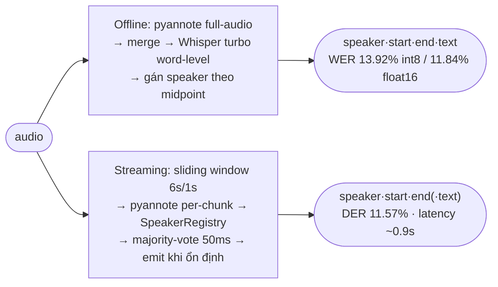

# Vietnamese Speech Diarization & ASR

Pipeline **"ai nói câu gì"** cho tiếng Việt: speaker diarization (pyannote) + ASR
(Whisper/Qwen), chạy **offline** hoặc **streaming real-time**, kèm REST/WebSocket API, web UI và giám sát. GPU CUDA (GTX 1650+) hoặc CPU.

[](https://github.com/GolDDragon1702/vsf_diarization/actions/workflows/ci.yml?query=branch%3Amain)

## Kết quả nhanh

| Metric (mean folder `test/`) | Giá trị |
|--------|---------|
| WER · CER (offline pipeline) | **13.92% · 10.32%** (int8 mặc định) · 11.84% · 9.28% (float16) |
| DER — offline pipeline / online w6 / **adaptive per-file** | 9.55% / 11.67% / **9.65%** (GT-free) |
| DER — pyannote raw (offline full-audio) | 14.72% |
| Streaming end-to-end | DER **11.57%** · WER 19.79% · RTF 0.65x · latency **~0.9s** |
| RTF full pipeline (ASR+diar) | **0.48x** (int8) · ~1.3x (float16) — diarization-only ~0.17x |

*GPU GTX 1650. Whisper mặc định `int8_float16` (real-time, RTF 0.48x); `--compute-type float16`cho WER thấp nhất. Online streaming thắng offline 7/11 file; adaptive per-file hạ DER < 10%.
Chi tiết & bảng per-file: [REPORT.md](REPORT.md).*

## Cài đặt

```powershell
git clone https://github.com/GolDDragon1702/vsf_diarization.git && cd vsf_diarization
python -m venv venv; .\venv\Scripts\Activate.ps1

# PyTorch TRƯỚC (theo CUDA của bạn) — pyannote phụ thuộc torch
pip install torch torchaudio --index-url https://download.pytorch.org/whl/cu128   # GPU CUDA 12.8
# pip install torch torchaudio --index-url https://download.pytorch.org/whl/cpu   # hoặc CPU

pip install -e .            # cơ bản (vsf-*) · ".[serve]" = +API/web · ".[qwen]" = +Qwen3 · ".[dev]" = +test
cp .env.example .env        # điền HF_TOKEN=hf_xxxx (token có quyền pyannote/speaker-diarization-3.1)
```

Tạo các lệnh **`vsf-diarize · vsf-stream · vsf-serve · vsf-evaluate · vsf-eval-streaming · vsf-create-gt`**.
Cần chấp nhận điều khoản tại [speaker-diarization-3.1](https://huggingface.co/pyannote/speaker-diarization-3.1)
+ [segmentation-3.0](https://huggingface.co/pyannote/segmentation-3.0).

## Sử dụng

```bash
# Offline: ai nói gì lúc nào
vsf-diarize audio.wav --asr whisper --language vi     # Whisper turbo (word-level)
vsf-diarize audio.wav --asr qwen    --language vi     # Qwen3-ASR-1.7B
vsf-diarize audio.wav --asr none    --num-speakers 2  # chỉ diarization

# Streaming real-time (in turn dần)
vsf-stream --source mic --live --num-speakers 2       # mic real-time thật
vsf-stream --source audio.wav --language vi           # giả lập từ file
vsf-stream --source audio.wav --no-asr                # chỉ diarization
```

### Server API + Web UI

```bash
pip install -e ".[serve]"
vsf-serve                    # → http://127.0.0.1:8000/
```

Web UI (`/`): tải file *hoặc* ghi mic real-time (WebSocket), transcript bong bóng tô màu theo người nói, **audio player đồng bộ** (bấm turn → tua + highlight), **timeline người nói**, **đổi tên speaker tại chỗ**, **xuất TXT/SRT/VTT/CSV/JSON**, caption *"🎧 đang nghe…"* giảm cảm giác trễ, dashboard giám sát. Upload được validate định dạng + size (≤ `VSF_MAX_UPLOAD_MB`, mặc định 100).

| Endpoint | Mô tả |
|----------|-------|
| `POST /transcribe` | upload file → `{turns:[{speaker,start,end,text}], rtf}` |
| `WS /ws/stream` | PCM float32 16kHz mono → turn real-time (gửi `EOF` để chốt) |
| `GET /health` · `/ready` | liveness (luôn 200) · readiness (model + GPU sống → 200/503) |
| `GET /metrics` · `/metrics/prometheus` | thống kê JSON · metrics Prometheus |
| `/` · `/demo` | web UI · Gradio thay thế |

Model **cache load 1 lần**; request được log có cấu trúc. Giám sát đầy đủ (App + Prometheus + Grafana, dashboard nạp sẵn) trong 1 lệnh — xem [monitoring/](monitoring/):

```bash
export HF_TOKEN=hf_xxx
docker compose -f monitoring/docker-compose.yml up --build   # App :8000 · Prometheus :9090 · Grafana :3000
```

### Đánh giá (cần ground truth)

```bash
vsf-create-gt test/ --language vi      # tạo draft ground_truth/*.json → sửa tay → annotation_status: "reviewed"
vsf-evaluate  test/ --language vi --output outputs/eval.json          # DER + WER + CER (thêm --compare-qwen)
vsf-eval-streaming test/ --language vi --min-asr 1.0 --output outputs/stream.json
```

## Cấu trúc

```
vsf_diarization/               # package (pip install -e .)
├── core/                      # dùng chung
│   ├── utils.py               #   load_audio · load_*models · whisper/qwen_transcribe · compute_der/asr · load_gt
│   ├── diarize_offline.py     #   run_offline(): pyannote full-audio
│   ├── diarize_online.py      #   run_online() + stream_online(): sliding window + majority vote 50ms
│   └── streaming_session.py   #   StreamingSession: engine real-time (feed chunk → turn) cho mic/WebSocket
├── pipelines/                 # entry points
│   ├── pipeline.py            #   vsf-diarize : offline (+ASR) --asr none|whisper|qwen
│   └── pipeline_streaming.py  #   vsf-stream  : streaming; --live = mic thật; --no-asr
├── serve/                     # API + web UI + observability (".[serve]")
│   ├── api.py                 #   vsf-serve : FastAPI / · /transcribe · /ws/stream · /health · /ready · /metrics · /demo
│   ├── static/                #   frontend (index.html · style.css · app.js)
│   ├── models.py              #   cache model + readiness (GPU) + Metrics JSON
│   ├── observability.py       #   logging + Prometheus + middleware
│   └── demo.py                #   Gradio UI thay thế
├── eval/                      # đánh giá & so sánh (python -m vsf_diarization.eval.<module>)
│   ├── evaluate.py            #   vsf-evaluate : DER+WER+CER vs GT (+Qwen)
│   ├── eval_streaming.py      #   vsf-eval-streaming : streaming end-to-end vs GT
│   ├── compare_diarization.py #   offline vs online (DER)
│   ├── sweep_online.py        #   quét window × threshold
│   ├── adaptive_window.py     #   chọn window per-file GT-free → DER 9.65%
│   ├── sweep_streaming.py     #   quét min_asr (WER vs coverage)
│   ├── eval_asr_models.py     #   benchmark ASR per-segment Whisper|Qwen|Nemotron
│   └── compare_asr_3models.py #   bảng 3 model từ outputs/asr_*.json (không GPU)
└── create_ground_truth.py     # vsf-create-gt : tạo draft GT để annotate
tests/          # unit test thuần (pytest + fake pipeline, không cần GPU/model)
monitoring/     # full-stack compose (App+Prometheus+Grafana) + dashboard nạp sẵn
Dockerfile · pyproject.toml · run_nemotron.sh (Nemotron trên WSL) · .github/workflows/ci.yml
```

> Chạy **từ thư mục có `ground_truth/`, `test/`** (đường dẫn dữ liệu tương đối CWD).
> `ground_truth/`, `test/`, `outputs/` không nằm trong package (`.gitignore`).

## Tham số quan trọng

| Tham số | Mặc định | Ghi chú |
|---------|----------|---------|
| `--compute-type` | `int8_float16` | `float16` cho WER thấp nhất (chậm ~2.6×); int8 nhanh (RTF 0.48x, WER +2%) |
| `--whisper-model` | `turbo` | tiny…large-v3, turbo |
| `--num-speakers` | auto | gợi ý số người nói (tăng DER) |
| `--window` / `--step` | `6` / `1` | cửa sổ streaming (giây) — 6s latency ~0.9s; 9s chính xác hơn (DER 10.53%) |
| `--threshold` | `0.70` | cosine speaker registry (0.80 over-split, tệ hơn) |

## Cách hoạt động



- **Diarization** ([pyannote 3.1](https://huggingface.co/pyannote/speaker-diarization-3.1)): xác định *ai nói lúc nào*.
- **ASR** ([faster-whisper turbo](https://github.com/SYSTRAN/faster-whisper)): `word_timestamps` → gán từng từ vào speaker theo midpoint (chính xác hơn per-segment).
- **Online streaming**: mỗi frame 50ms được ~6 cửa sổ bầu → thắng theo đa số, emit khi ổn định. Đạt **DER 11.67% vs offline raw 14.72%** (thắng 7/11) nhờ tránh clustering toàn cục + giảm Miss; `adaptive_window` chọn window per-file GT-free hạ còn **9.65%**.

| | Offline pipeline | Streaming end-to-end |
|---|---|---|
| DER | 9.55% (raw 14.72%) | **11.57%** |
| WER (int8 · float16) | **13.92% · 11.84%** | 19.79% · 19.25% |
| RTF (int8) | 0.48x | 0.65x |
| Latency | chờ hết file | **~0.9s** |
| Dùng khi | transcript chính xác nhất | real-time / live |

## Test & CI

```bash
pip install -e ".[dev]"
ruff check vsf_diarization tests   # lint
mypy                               # type-check (serve/ + streaming_session)
pytest                             # unit test (không cần GPU/model/HF token)
```

CI ([ci.yml](.github/workflows/ci.yml)) chạy **ruff + mypy + pytest** trên CPU mỗi push/PR.

## Docker (GPU) & Nemotron

```bash
docker build -t vsf-diarization .
docker run --gpus all -e HF_TOKEN=hf_xxx -v "$PWD/test:/app/test" -v "$PWD/outputs:/app/outputs" \
    vsf-diarization  vsf-diarize test/test01.wav --asr whisper --language vi   # hoặc: vsf-serve --host 0.0.0.0
```

> **Nemotron-3.5-ASR** chỉ chạy trên **Linux/WSL** (NeMo `transcribe()` lỗi trên Windows native):
> `bash run_nemotron.sh` trong WSL → `python -m vsf_diarization.eval.compare_asr_3models`.

## Xử lý lỗi thường gặp

- **`HF_TOKEN missing`** → tạo `.env` từ `.env.example`, điền token.
- **`Cannot find module qwen_asr`** → `pip install qwen-asr`.
- **pyannote không tải model** → chấp nhận terms of use trên HuggingFace.
- **CUDA out of memory** → chạy CPU: `CUDA_VISIBLE_DEVICES=""`.
- **`run_nemotron.sh` lỗi `\r`** (WSL) → `sed -i 's/\r$//' run_nemotron.sh`.

## Thư viện chính

pyannote.audio ≥3.1 (diarization) · faster-whisper ≥1.0 (ASR word-level) · qwen-asr (Qwen3) · soundfile · jiwer (WER/CER) · pyannote.metrics (DER) · fastapi/uvicorn/gradio/prometheus-client (serve).
