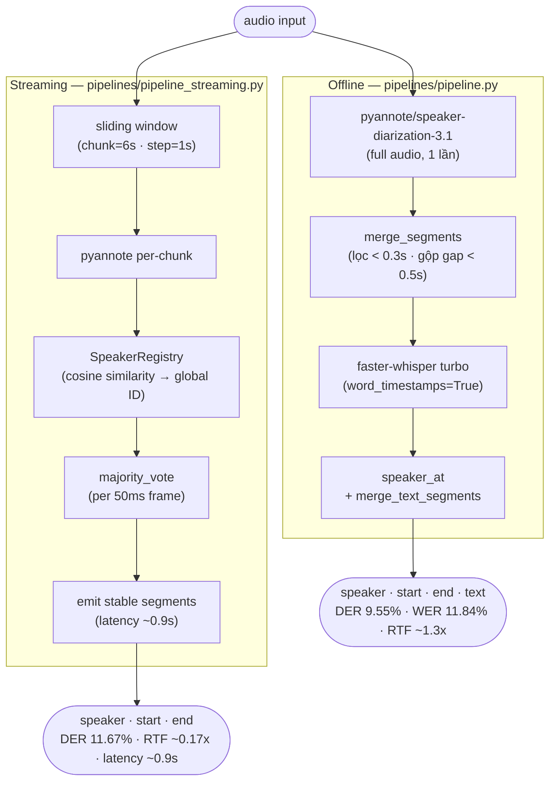

# Vietnamese Speech Diarization & ASR

Pipeline nhận dạng giọng nói + phân biệt người nói (speaker diarization) cho tiếng Việt.  
Chạy trên GPU CUDA (NVIDIA GTX 1650+) hoặc CPU.

---

## Kết quả nhanh

| Metric | Giá trị |
|--------|---------|
| WER (Word Error Rate) | **11.84%** |
| CER (Character Error Rate) | **9.28%** |
| DER — online adaptive per-file window | **9.65%** ← tốt nhất (GT-free) |
| DER — online streaming fixed w6 (chunk=6s) | 11.67% (thắng 7/11) |
| DER — offline (pyannote raw, full-audio) | 14.72% |
| RTF diarization streaming | **~0.17x** (latency ~0.9s) |
| RTF full pipeline (ASR + diarization) | ~1.07–2.15x (mean ~1.3x) |

*Trung bình trên 11 file ground truth đã reviewed (test01–test11, ~877s hội thoại tiếng Việt), GPU GTX 1650. Online streaming thắng 7/11 file; adaptive per-file window (`adaptive_window.py`, chọn window không cần nhãn) hạ DER xuống 9.65%. Chi tiết: [REPORT.md](REPORT.md).*

---

## Yêu cầu hệ thống

- Python 3.10+
- NVIDIA GPU (tối thiểu 4GB VRAM) — hoặc CPU (chậm hơn ~5x)
- CUDA 12.x (nếu dùng GPU)
- [Hugging Face token](https://huggingface.co/settings/tokens) có quyền truy cập `pyannote/speaker-diarization-3.1`

---

## Cài đặt

```powershell
# 1. Clone hoặc copy project về máy

# 2. Tạo virtual environment
python -m venv venv
.\venv\Scripts\Activate.ps1

# 3. Cài PyTorch (chọn 1 trong 2)
# GPU (CUDA 12.8):
pip install torch torchaudio --index-url https://download.pytorch.org/whl/cu128
# CPU:
pip install torch torchaudio --index-url https://download.pytorch.org/whl/cpu

# 4. Cài các thư viện còn lại
pip install pyannote.audio faster-whisper soundfile sounddevice numpy python-dotenv
pip install pyannote.metrics jiwer librosa   # evaluate.py / eval_asr_models.py
pip install qwen-asr                          # chỉ khi dùng Qwen3-ASR

# 5. Cấu hình token
cp .env.example .env
# Mở .env, điền HF_TOKEN=hf_xxxx...
```

> **Tự động:** có thể chạy `setup_venv.ps1` (PowerShell) để tạo venv + cài sẵn các bước trên.
>
> **Nemotron-3.5-ASR (tùy chọn):** chỉ chạy được trên **Linux/WSL** (không phải Windows native). Không cài vào venv này — dùng `bash run_nemotron.sh` trong WSL, nó tự tạo venv riêng. Xem **Bảng tra cứu → mục 5) Nemotron** bên dưới.

**Lưu ý:** Cần chấp nhận điều khoản sử dụng tại:
- https://huggingface.co/pyannote/speaker-diarization-3.1
- https://huggingface.co/pyannote/segmentation-3.0

---

## Sử dụng nhanh

### Nhận dạng file audio (offline)

```bash
# Whisper turbo — output ai nói gì lúc nào
python pipelines/pipeline.py audio.wav --asr whisper --language vi

# Qwen3-ASR-1.7B thay cho Whisper
python pipelines/pipeline.py audio.wav --asr qwen --language vi

# Chỉ diarization (không ASR)
python pipelines/pipeline.py audio.wav --asr none --num-speakers 2
```

### Streaming real-time

```bash
# Từ microphone
python pipelines/pipeline_streaming.py --source mic

# Giả lập streaming từ file
python pipelines/pipeline_streaming.py --source audio.wav --language vi

# Chỉ diarization streaming (không ASR)
python pipelines/pipeline_streaming.py --source audio.wav --no-asr
```

### Đánh giá chất lượng (cần ground truth)

```bash
# Bước 1: Tạo draft ground truth
python create_ground_truth.py test/audio.wav --language vi
# → Tạo ground_truth/audio.json

# Bước 2: Chỉnh sửa thủ công ground_truth/audio.json
# - Đổi SPEAKER_00 → tên thật (tuỳ chọn)
# - Sửa text sai, timestamp lệch
# - Đổi annotation_status: "draft" → "reviewed"

# Bước 3: Chạy đánh giá
python eval/evaluate.py test/audio.wav --language vi
python eval/evaluate.py test/audio.wav --compare-qwen --language vi  # so sánh 2 model

# Đánh giá toàn bộ folder
python eval/evaluate.py test/ --language vi --output outputs/eval_results.json
```

> Đánh giá & so sánh model/chiến lược: xem **[Bảng tra cứu: chạy từng script](#bảng-tra-cứu-chạy-từng-script)** bên dưới.
> Tóm tắt ASR per-segment (11 file): **Qwen3-ASR 18.46% WER** (thắng 8/11) < **Whisper turbo 23.47%**; nhưng full-audio pipeline Whisper đạt **11.84%** nhờ ngữ cảnh dài + word timestamp.

---

## Cấu trúc file

> **Chạy mọi lệnh từ thư mục gốc dự án** (`diarization/`). Các script trong `pipelines/` và `eval/` tự thêm gốc dự án vào `sys.path`, nên chạy trực tiếp `python pipelines/pipeline.py …` hoặc dạng module `python -m pipelines.pipeline …` đều được.

```
diarization/
│  ── core/ — module dùng chung (chỉ import) ──────────────────
├── core/utils.py               # load_audio · load_*models · whisper/qwen_transcribe · compute_der/asr · load_gt · iter_wavs
├── core/diarize_offline.py     # run_offline(): pyannote full-audio → (segments, elapsed)
├── core/diarize_online.py      # run_online() (batch) + stream_online() (generator): sliding window + majority vote
│
│  ── pipelines/ — inference (chạy từ gốc dự án) ───────────────
├── pipelines/pipeline.py            # Offline diarization (+ASR): --asr none|whisper|qwen
├── pipelines/pipeline_streaming.py  # Streaming ASR+diar real-time (mic/file); --no-asr = chỉ diarization
│
│  ── eval/ — ground truth & đánh giá ──────────────────────────
├── eval/evaluate.py            # DER + WER + CER vs GT (offline; tùy chọn so Qwen)
├── eval/eval_streaming.py         # Đánh giá streaming end-to-end (DER + WER/CER + coverage)
├── eval/compare_diarization.py # Offline vs Online diarization (DER vs GT)
├── eval/sweep_online.py        # Quét window × threshold (load model 1 lần)
├── eval/adaptive_window.py     # Chọn window per-file GT-free (offline-agreement) → DER 9.65%
├── eval/sweep_streaming.py        # Quét min_asr cho streaming (transcribe 1 lần, mask N ngưỡng)
├── eval/eval_asr_models.py     # Benchmark ASR per-segment: Whisper|Qwen|Nemotron (self-contained, chạy được venv_nemo)
├── eval/compare_asr_3models.py # In bảng so sánh 3 model từ outputs/asr_*.json (không cần GPU)
│
├── create_ground_truth.py      # Tạo draft GT (annotate thủ công rồi đổi status=reviewed)
├── run_nemotron.sh             # Cài NeMo + benchmark Nemotron trong WSL2 (chỉ Linux/WSL)
│
│  ── Data / config ───────────────────────────────────────────
├── ground_truth/               # GT *.json — 11 reviewed (test01–test11)
├── test/                       # WAV test (test01.wav … test11.wav)
├── outputs/                    # JSON kết quả evaluation
├── .env / .env.example         # HF_TOKEN, HF_HOME
├── requirements.txt
└── setup_venv.ps1              # Script tạo venv tự động (PowerShell)
```

---

## Bảng tra cứu: chạy từng script

> Chạy **từ thư mục gốc dự án**. Hầu hết nhận `input` là **file `.wav`** hoặc **thư mục** (xử lý mọi `.wav` bên trong). Thêm `--num-speakers 2` nếu biết trước số người nói. Mọi script cần `HF_TOKEN` trong `.env` (trừ `eval/compare_asr_3models.py`).

### 1) Inference — nhận dạng / phân tách

| Script | Lệnh chạy | Output |
|--------|-----------|--------|
| **pipelines/pipeline.py** | `python pipelines/pipeline.py audio.wav --asr whisper --language vi [--num-speakers 2] [--output out.json]` | `{speaker, start, end, text}` (Whisper turbo) |
| ↳ Qwen3-ASR | `python pipelines/pipeline.py audio.wav --asr qwen --language vi [--qwen-model Qwen/Qwen3-ASR-1.7B]` | như trên (Qwen3-ASR) |
| ↳ chỉ diarization | `python pipelines/pipeline.py audio.wav --asr none [--num-speakers 2]` | chỉ `{speaker, start, end}` |

### 2) Streaming real-time

| Script | Lệnh chạy | Ghi chú |
|--------|-----------|---------|
| **pipelines/pipeline_streaming.py** | `python pipelines/pipeline_streaming.py --source audio.wav --language vi --num-speakers 2 [--min-asr 1.0] [--output out.json] [--realtime]`<br>`python pipelines/pipeline_streaming.py --source mic --language vi` | ASR + diarization (dùng chung `stream_online`), in dần; turn < `min-asr` in `"..."` |
| ↳ chỉ diarization | `python pipelines/pipeline_streaming.py --source audio.wav --no-asr --chunk 6 --step 1 [--output out.json]` | bỏ Whisper, emit segment {speaker,start,end} dần |

### 3) Tạo & đánh giá ground truth

| Script | Lệnh chạy | Mục đích |
|--------|-----------|----------|
| **create_ground_truth.py** | `python create_ground_truth.py test/ --language vi [--strategy offline\|online] [--force]` | tạo `ground_truth/*.json` draft → sửa tay → đổi `annotation_status: reviewed` |
| **eval/evaluate.py** | `python eval/evaluate.py test/ --language vi [--compare-qwen] --output outputs/eval_results.json` | DER + WER + CER cho pipeline Whisper (và Qwen nếu `--compare-qwen`) |
| **eval/eval_streaming.py** | `python eval/eval_streaming.py test/ --language vi --min-asr 1.0 --output outputs/streaming_eval.json` | Đánh giá streaming end-to-end: DER + WER/CER + ASR coverage |

### 4) So sánh chiến lược & model

| Script | Lệnh chạy | Mục đích |
|--------|-----------|----------|
| **eval/compare_diarization.py** | `python eval/compare_diarization.py test/ --window 6 --step 1 --threshold 0.70 --output outputs/diar_11files_w6.json` | Offline (pyannote raw) vs Online (streaming) — DER vs GT |
| **eval/sweep_online.py** | `python eval/sweep_online.py test/ --windows 4 6 9 --thresholds 0.70 0.80 --step 1 --output outputs/sweep_online.json` | tìm window×threshold tối ưu (in BEST) |
| **eval/adaptive_window.py** | `python eval/adaptive_window.py test/ --windows 4 6 9 --output outputs/adaptive_window.json` | chọn window per-file GT-free (offline-agreement); in adaptive vs oracle vs fixed |
| **eval/sweep_streaming.py** | `python eval/sweep_streaming.py test/ --language vi --min-asr 1.0 1.5 2.0 --output outputs/streaming_sweep.json` | quét ngưỡng `min_asr` (WER vs coverage) |
| **eval/eval_asr_models.py** | `python eval/eval_asr_models.py test/ --model whisper --language vi --output outputs/asr_whisper.json`<br>`python eval/eval_asr_models.py test/ --model qwen --language vi --output outputs/asr_qwen.json` | benchmark ASR thuần (cắt theo GT segment), WER/CER/RTF |
| **eval/compare_asr_3models.py** | `python eval/compare_asr_3models.py` | in bảng so sánh Whisper/Qwen/Nemotron từ `outputs/asr_*.json` (không GPU) |

### 5) Nemotron-3.5 ASR (chỉ Linux/WSL — xem [REPORT.md](REPORT.md) mục 5.2/8.1)

```bash
# Trong WSL2 Ubuntu, tại thư mục project:
cd /mnt/c/Users/longph31/Documents/diarization
bash run_nemotron.sh                  # tự cài NeMo + chạy 11 file → outputs/asr_nemotron.json
python compare_asr_3models.py         # xem so sánh 3 model
```
> Nemotron **không chạy được trên Windows native** (NeMo transcribe() lỗi: numpy decode rỗng / khóa manifest tạm). `run_nemotron.sh` tự cài `torch cu128 + nemo_toolkit[asr] git@main` trong WSL.

---

## Tham số quan trọng

### pipelines/pipeline.py / eval/evaluate.py

| Tham số | Mặc định | Mô tả |
|---------|----------|-------|
| `--whisper-model` | `turbo` | Kích thước Whisper: tiny, base, small, medium, large-v3, turbo |
| `--language` | auto | Mã ngôn ngữ: `vi`, `en`, `zh`, ... |
| `--num-speakers` | auto | Gợi ý số người nói (giúp tăng DER) |
| `--compare-qwen` | off | Chạy thêm Qwen3-ASR để so sánh |

### compare_diarization.py

| Tham số | Tối ưu | Mô tả |
|---------|--------|-------|
| `--window` | `6` | Kích thước cửa sổ (giây) — 6s default streaming (DER 11.67%, latency thấp); 9s chính xác hơn (10.53%); 4s gây confusion. Dùng `adaptive_window.py` để chọn tự động per-file (9.65%) |
| `--step` | `1` | Bước trượt (giây) — nhỏ hơn = latency thấp hơn, nhiều computation hơn |
| `--threshold` | `0.70` | Cosine similarity cho speaker registry — 0.70 tối ưu; 0.80 gây over-split, DER tệ hơn |

---

## Cách hoạt động

### Pipeline toàn bộ



**So sánh hai chiến lược:**

| | Offline pipeline | Streaming end-to-end |
|---|---|---|
| DER (11 file) | 14.72% (raw) / 9.55% (pipeline) | **11.57%** |
| WER (Whisper) | **11.84%** | 19.25% (per-turn streaming) |
| RTF full pipeline | ~1.3x | **0.97x** (real-time) |
| ASR coverage | 100% | 99.15% (turn ngắn → `...`) |
| Latency first output | chờ hết file | **~0.9s** |
| Dùng khi | cần transcript chính xác nhất | real-time / live |

*Streaming end-to-end (dùng `stream_online()`) đạt DER 11.57% ≈ online-batch 11.67% — diarization streaming tốt nhất, thắng 7/11 file. WER cao hơn offline (mất ngữ cảnh xuyên turn) nhưng chạy real-time (RTF 0.97x). Chi tiết: [REPORT.md](REPORT.md) mục 6.5.*

### Speaker Diarization
[pyannote/speaker-diarization-3.1](https://huggingface.co/pyannote/speaker-diarization-3.1) phân tích audio để xác định *ai nói lúc nào* (không nhận dạng từ ngữ). Output: danh sách turns `{speaker, start, end}`.

### ASR (Automatic Speech Recognition)
[faster-whisper turbo](https://github.com/SYSTRAN/faster-whisper) nhận dạng nội dung từng đoạn audio. Với `word_timestamps=True`, có thể gán từng từ vào đúng speaker theo midpoint của từng từ — chính xác hơn so với gán per-segment.

### Online Streaming (diart-style)
Thay vì xử lý toàn bộ audio, pipeline trượt cửa sổ 6s theo bước 1s. Mỗi cửa sổ vote cho từng frame 50ms. Frame được gán speaker theo đa số vote, emit ngay khi frame ổn định (latency ~0.9s). Trên 11 file GT reviewed, online streaming fixed w6 đạt **DER 11.67% vs offline 14.72% — thắng 7/11 file**, nhờ (1) tránh lỗi clustering toàn cục khi hai giọng giống nhau (test02/test07: offline ~33% → online ~2-5%) và (2) giảm Miss nhờ cửa sổ chồng lấp. Window tối ưu phụ thuộc file (w6/w9 khác nhau) → `adaptive_window.py` chọn window per-file không cần nhãn (offline-agreement) hạ DER xuống **9.65%**, vượt mọi window cố định. Online chỉ thua ở vài ca biên (test04/test09 cần window lớn hơn — adaptive sửa được; test03 hội thoại lệch 90/10). Xem [REPORT.md](REPORT.md) để biết chi tiết.

---

## Xử lý lỗi thường gặp

**`HF_TOKEN missing`**
→ Tạo file `.env` từ `.env.example`, điền token từ huggingface.co/settings/tokens

**`Cannot find module qwen_asr`** (chỉ khi dùng Qwen3)
→ `pip install qwen-asr`

**`pyannote.audio` không tìm thấy model**
→ Chấp nhận terms of use tại huggingface.co/pyannote/speaker-diarization-3.1

**CUDA out of memory**
→ Chạy CPU với `CUDA_VISIBLE_DEVICES=""`

**Nemotron / NeMo lỗi trên Windows** (numpy decode rỗng, `PermissionError WinError 32` manifest)
→ NeMo transcribe() không chạy trên Windows native. Dùng WSL2: `bash run_nemotron.sh` (xem [REPORT.md](REPORT.md) mục 8.1)

**`bad interpreter` / lỗi `\r`** khi chạy `run_nemotron.sh` trong WSL
→ File bị CRLF: `sed -i 's/\r$//' run_nemotron.sh` rồi chạy lại

---

## Thư viện chính

| Thư viện | Phiên bản | Vai trò |
|----------|-----------|---------|
| [pyannote.audio](https://github.com/pyannote/pyannote-audio) | ≥3.1 | Speaker diarization |
| [faster-whisper](https://github.com/SYSTRAN/faster-whisper) | ≥1.0 | ASR với word timestamps |
| [qwen-asr](https://huggingface.co/Qwen/Qwen3-ASR-1.7B) | latest | Qwen3-ASR-1.7B pipeline |
| [soundfile](https://python-soundfile.readthedocs.io) | ≥0.12 | Đọc WAV/FLAC |
| [jiwer](https://github.com/jitsi/jiwer) | latest | Tính WER/CER |
| [pyannote.metrics](https://pyannote.github.io/pyannote-metrics) | latest | Tính DER |
| [librosa](https://librosa.org) | ≥0.10 | Resample audio (eval_asr_models) |
| [nemo_toolkit\[asr\]](https://github.com/NVIDIA/NeMo) | git@main | Nemotron-3.5 streaming ASR (chỉ Linux/WSL) |
