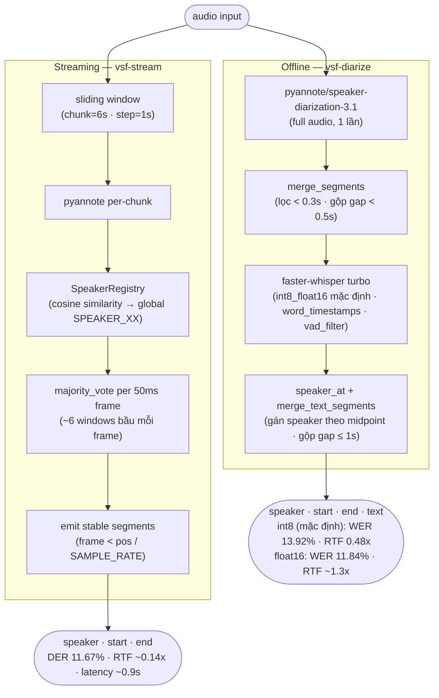
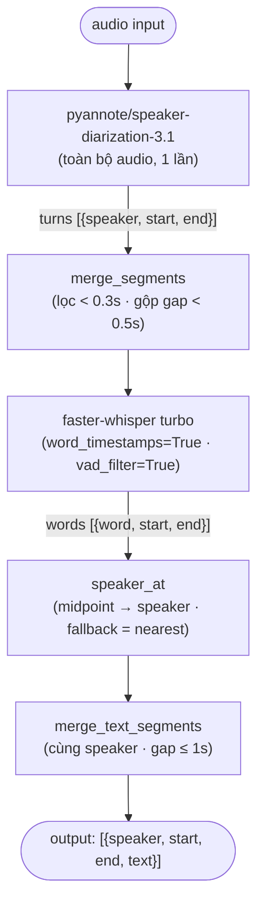

# Báo cáo: Hệ thống Diarization + ASR Tiếng Việt

> Cập nhật lần cuối: 2026-06-29 (thêm lớp triển khai: real-time streaming engine, REST/WebSocket API, web UI, observability Prometheus/Grafana, CI — **mục 8**). Đánh giá chất lượng trên **toàn bộ folder `test/`** (ground truth đã reviewed).

---

## 1. Tổng quan

Xây dựng và đánh giá pipeline nhận dạng giọng nói + phân biệt người nói (speaker diarization) cho tiếng Việt. Chạy trên GPU NVIDIA GTX 1650 (CUDA 12.8, torch 2.11.0+cu128).

**Mục tiêu:** So sánh hai chiến lược:
1. **Offline** — pyannote xử lý toàn bộ audio một lần, Whisper hoặc Qwen3-ASR nhận dạng từng đoạn.
2. **Online (streaming)** — sliding window diart-style: xử lý từng cửa sổ ngắn, emit kết quả dần dần để phục vụ real-time.

---

## 2. Kiến trúc hệ thống

### 2.1 Pipeline toàn bộ — tổng quan



**So sánh các chiến lược (đo trên toàn bộ folder `test/` đã reviewed):**

| Chiến lược | DER | WER | RTF diarization | RTF full pipeline | Latency output |
|---|---:|---:|---:|---:|---|
| Offline diarization (pyannote raw, full-audio) | 14.72% | — | ~0.09x | — | batch |
| Offline pipeline (pyannote + Whisper word-align) | 9.55% | **11.84%** | — | ~1.3x | batch |
| Online diarization-only fixed w6 (chunk=6s, batch) | 11.67% | — | **~0.17x** | — | — |
| **Online adaptive per-file window (offline-agreement)** | **9.65%** | — | ~0.5x* | — | — |
| **Streaming end-to-end (chunk=6s + Whisper)** | 11.57% | 19.25% | — | **0.97x** | **~0.9s** |

> ⚙️ **Số WER/RTF trong bảng đo ở `float16` (accuracy mode).** Mặc định Whisper chạy **`int8_float16`** (nhanh ~2.6×): offline WER **13.92%** · RTF **0.48x**; streaming WER **19.79%** · RTF **0.65x** — xem **mục 7.1**. Dùng `--compute-type float16` để có số float16. Phần diarization (DER) không phụ thuộc compute_type.

*Trung bình trên toàn bộ folder test. **Online là chiến lược diarization tốt nhất** — fixed w6 DER 11.67% vs offline raw 14.72%, thắng đa số (mục 6.2); **adaptive per-file window (chọn window GT-free) hạ xuống 9.65%** ≈ offline pipeline, vượt mọi window cố định (mục 6.1). Pipeline offline cho WER thấp nhất (11.84% float16) nhờ ngữ cảnh full-audio + word-timestamp; streaming end-to-end chạy real-time đổi lại WER cao hơn (mục 6.5).*

> *Adaptive RTF ~0.5x do chạy offline tham chiếu + nhiều window để chọn; nếu chỉ chạy window đã chọn thì ~0.17x. Streaming end-to-end (diarization + ASR real-time) **đã tích hợp** trong `vsf-stream` (`pipeline_streaming.py`, dùng chung `stream_online()` + Whisper per-turn): output `{speaker, start, end, text}` — xem **mục 6.5**.

---

### 2.2 Pipeline offline chi tiết (vsf-diarize)



### 2.3 Pipeline online streaming (vsf-stream / eval.compare_diarization)


**Hai chế độ hoạt động:**

| Mode | Hàm | Output | Latency | Dùng khi |
|------|-----|--------|---------|----------|
| Batch | `run_online()` | Tất cả segments cùng lúc | Sau khi xử lý hết file | Đánh giá / compare |
| **Streaming** | `stream_online()` | Generator yield từng batch | ≈ chunk_s × RTF | **Ứng dụng thực tế** |

---

## 3. Cấu trúc file

Code đóng gói trong package `vsf_diarization/` (cài `pip install -e .` → lệnh `vsf-*`).

```
vsf_diarization/                # ← Python package
│  ── core/ — module dùng chung (import) ─────────────────────
├── core/diarize_offline.py     # run_offline(): pyannote full-audio → (segments, elapsed)
├── core/diarize_online.py      # run_online() + stream_online(): sliding window + majority vote
├── core/streaming_session.py   # StreamingSession: engine real-time, feed chunk → turn (mic/WebSocket) — mục 8.1
├── core/utils.py               # load_audio, load_models, whisper/qwen_transcribe, compute_der, load_gt, iter_wavs
│
│  ── pipelines/ — entry points inference ──────────────────────
├── pipelines/pipeline.py            # vsf-diarize : offline diarization (+ASR) --asr none|whisper|qwen
├── pipelines/pipeline_streaming.py  # vsf-stream  : streaming real-time; --live = mic thật; --no-asr
│
│  ── serve/ — API + web UI + observability (mục 8) ────────────
├── serve/api.py                # vsf-serve : FastAPI / · /transcribe · /ws/stream · /health · /ready · /metrics
├── serve/static/               # frontend web (upload + mic real-time + dashboard giám sát)
├── serve/models.py             # cache model (load 1 lần) + readiness (GPU sống) + Metrics JSON
├── serve/observability.py      # logging có cấu trúc + Prometheus metrics + middleware
├── serve/demo.py               # Gradio UI thay thế
│
│  ── eval/ — evaluation & comparison ─────────────────────────
├── eval/evaluate.py            # vsf-evaluate : offline vs GT — DER, WER, CER (+Qwen)
├── eval/eval_streaming.py      # vsf-eval-streaming : streaming end-to-end vs GT
├── eval/compare_diarization.py # Offline vs online diarization (DER vs GT)
├── eval/sweep_online.py        # Quét window × threshold (load model 1 lần)
├── eval/adaptive_window.py     # Chọn window per-file GT-free (offline-agreement) → 9.65%
├── eval/sweep_streaming.py     # Quét min_asr cho streaming
├── eval/eval_asr_models.py     # Benchmark ASR per-segment Whisper|Qwen|Nemotron (self-contained)
├── eval/compare_asr_3models.py # In bảng 3 model từ outputs/asr_*.json (không GPU)
└── create_ground_truth.py      # vsf-create-gt : tạo draft GT để annotate tay

tests/                          # unit test thuần (pytest + fake pipeline, không cần GPU/model)
monitoring/                     # full-stack compose (App+Prometheus+Grafana) + Grafana dashboard
.github/workflows/ci.yml        # CI: ruff + mypy + pytest (CPU)
pyproject.toml                  # metadata + deps + entry points vsf-* + extras [serve]/[dev]
Dockerfile / .dockerignore      # image GPU CUDA 12.8 (CLI + server)
run_nemotron.sh                 # Nemotron benchmark (WSL2)
ground_truth/ · test/ · outputs/  # dữ liệu runtime (.gitignore)
```

**Lưu ý về overlap giữa scripts:**
| Lệnh | Mô tả | Khi nào dùng |
|--------|--------|--------------|
| `vsf-evaluate` | Đầy đủ nhất: chạy pipeline offline + so sánh GT + tùy chọn Qwen3 | Đánh giá chất lượng có GT |
| `eval.eval_asr_models` | Benchmark ASR thuần per-segment (Whisper/Qwen/Nemotron) | So WER các model trên cùng audio |
| `eval.compare_diarization` | Offline vs Online diarization, có GT | Đánh giá chiến lược diarization |
| `vsf-diarize --asr none\|whisper\|qwen` | Inference offline 1 file | Chạy thực tế (diarization + ASR) |

---

## 4. Ghi chú kỹ thuật (lỗi dev-time đã xử lý)

- **soundfile thay torchaudio**: torchaudio 2.11 dùng torchcodec (cần FFmpeg DLL không có sẵn) → đọc WAV bằng `soundfile` + waveform dict `{"waveform", "sample_rate"}`.
- **Qwen3-ASR**: không có architecture trong transformers → cài package riêng `pip install qwen-asr`.
- **speaker_at fallback** (từ nằm khoảng trống → gán speaker gần nhất, không trả "UNKNOWN") · **merge_text_segments** (gộp fragment cùng speaker gap ≤ 1s) · **online Miss 39% → frame-level majority voting** (mục 6).

---

## 5. Đánh giá ASR — Whisper turbo vs Qwen3-ASR-1.7B

*Đo trên toàn bộ folder `test/` (ground truth đã reviewed). Diarization: pyannote offline + gán speaker theo word-timestamp của Whisper, num_speakers từ GT. **Bảng 5.1 đo ở `float16` (accuracy mode)** — runtime mặc định là `int8_float16` (nhanh 2.6×, WER +2%, mục 7.1).*

### 5.1 Whisper turbo (pyannote + faster-whisper turbo)

| File | Duration | DER | Miss | FA | Conf | WER | CER | RTF |
|------|------:|----:|-----:|---:|-----:|----:|----:|----:|
| test01.wav | 46s | 3.32% | 0.1% | 0.0% | 3.2% | **2.12%** | **1.77%** | 1.16x |
| test02.wav | 51s | 32.79% | 0.8% | 0.0% | 32.0% | 1.72% | 1.06% | 1.31x |
| test03.wav | 197s | 7.30% | 1.0% | 0.7% | 5.6% | 19.63% | 15.01% | 1.17x |
| test04.wav | 93s | 7.82% | 2.7% | 2.4% | 2.7% | 11.32% | 8.87% | 1.07x |
| test05.wav | 83s | 14.26% | 0.6% | 6.8% | 6.9% | 33.44% | 34.77% | 1.61x |
| test06.wav | 85s | 2.50% | 1.5% | 0.0% | 1.0% | 6.25% | 3.16% | 1.34x |
| test07.wav | 51s | 29.36% | 0.2% | 0.0% | 29.1% | 13.51% | 8.84% | 1.11x |
| test08.wav | 74s | **0.00%** | 0.0% | 0.0% | 0.0% | 16.44% | 12.24% | 2.15x |
| test09.wav | 94s | 7.67% | 0.0% | 2.9% | 4.8% | 19.67% | 13.55% | 1.31x |
| test10.wav | 52s | **0.00%** | 0.0% | 0.0% | 0.0% | 1.97% | 1.48% | 1.14x |
| test11.wav | 49s | **0.00%** | 0.0% | 0.0% | 0.0% | 4.14% | 1.29% | 1.19x |
| **Trung bình (float16)** | toàn bộ | **9.55%** | — | — | — | **11.84%** | **9.28%** | **~1.3x** |
| **Trung bình (int8 mặc định)** | toàn bộ | **11.08%** | — | — | — | **13.92%** | **10.32%** | **0.48x** |

> Đây là DER của **pipeline đầy đủ** (pyannote + gán speaker per-word của Whisper). test08/10/11 đạt DER 0% vì là monologue / hội thoại rõ ràng + word-align làm sạch biên. Lưu ý DER này thấp hơn DER của **pyannote thô** (mục 6.2) do bước gán lại theo word-timestamp.

### 5.2 Benchmark ASR có kiểm soát — Whisper vs Qwen3 vs Nemotron 3.5

*Đo trên toàn bộ folder test. Phương pháp: cắt audio theo **đúng ranh giới segment trong ground truth** rồi đưa từng đoạn cho model — mọi model thấy audio giống hệt với ranh giới lý tưởng, nên WER/CER đo **chất lượng nhận dạng thuần**, tách khỏi diarization. Khác với mục 5.1 (Whisper full-audio qua pyannote turns). Script: `eval.eval_asr_models --model {whisper,qwen,nemotron}` (benchmark này chạy float16).*

| Model | Params | Mean WER | Mean CER | Mean RTF | Thắng/11 |
|-------|-------:|---------:|---------:|---------:|:-------:|
| Whisper turbo (vad=True) | 809M | 23.47% | 18.69% | **1.06x** | 3 |
| **Qwen3-ASR-1.7B** | 1.7B | **18.46%** | **13.91%** | 1.11x | **8** |
| Nemotron-3.5-streaming-0.6b | 0.6B | _N/A (xem ghi chú)_ | — | — | — |

**Per-file WER (controlled, theo GT segment):**

| File | Số segment | Whisper | Qwen3 | Thắng |
|------|:----:|--------:|------:|:-----:|
| test01 | 17 | **11.64%** | 14.81% | Whisper |
| test02 | 2 | 5.60% | **3.45%** | Qwen |
| test03 † | 26 | 77.27% | **70.19%** | (số pre-fix, xem †) |
| test04 | 16 | 31.27% | **18.33%** | Qwen |
| test05 | 16 | 34.11% | **20.86%** | Qwen |
| test06 | 7 | 11.46% | **8.07%** | Qwen |
| test07 | 2 | 17.57% | **8.56%** | Qwen |
| test08 | 1 | 18.79% | **15.44%** | Qwen |
| test09 | 21 | 41.53% | **27.60%** | Qwen |
| test10 | 1 | **2.46%** | 3.94% | Whisper |
| test11 | 1 | **6.51%** | 11.83% | Whisper |
| **Trung bình** | — | 23.47% † | **18.46%** † | **Qwen 8/11** |

> † **test03 pre-fix:** số per-segment đo trước khi vá lỗi timestamp GT (cắt 89s audio vs ~16s text → insertion khổng lồ), thổi WER lên 77/70% và kéo mean lên. Mean thật sau vá sẽ thấp hơn 23.47/18.46.

**Nhận xét:**
- **Qwen3-ASR** chính xác nhất trên đoạn ngắn isolated (WER 18.46%, thắng 8/11) nhưng chậm (RTF 1.11x) và **không có word timestamp** → không gán speaker word-level.
- **Whisper turbo** yếu trên đoạn ngắn (per-segment 23.47%, hay hallucinate) nhưng **full-audio đạt 11.84%** (mục 5.1) nhờ ngữ cảnh dài, và có **word timestamp** → lựa chọn cho pipeline offline.
- test03 † (77/70%) là do lỗi biên GT (đã vá), không phải model/audio.

**Chọn model:** pipeline đầy đủ → **Whisper turbo** (word timestamp + nhanh); chỉ cần ASR per-utterance → **Qwen3-ASR** (WER thấp hơn nhưng chậm, không timestamp).

**Khuyến nghị cho streaming (ưu tiên độ trễ thấp + xử lý theo chunk):**

| Tiêu chí streaming | Nemotron-3.5-0.6b | Qwen3-ASR-1.7b | Whisper turbo |
|---|:---:|:---:|:---:|
| Thiết kế streaming gốc | ✅ cache-aware, latency 80ms–1s | ❌ per-utterance batch | ❌ cửa sổ 30s |
| Độ chính xác đoạn ngắn | _chưa đo_ | ✅ tốt nhất (18.46%) | ⚠️ 23.47% |
| Tốc độ (RTF, GTX 1650) | _chưa đo_ (0.6B → kỳ vọng < 1) | ⚠️ 1.11x | ⚠️ 1.06x |
| Word timestamp (gán speaker incremental) | tùy | ❌ | ✅ |
| Chạy trên Windows | ❌ (cần Linux/WSL) | ✅ | ✅ |

- **Nemotron-3.5-0.6b** — model *duy nhất thiết kế gốc cache-aware streaming* (latency 80ms–1s), nhỏ nhất → kỳ vọng nhanh nhất. **Chưa chạy được trên Windows** (mục 9.1).
- **Whisper turbo** — khả dụng ngay, có **word timestamp** cho emit `(speaker, text)` incremental; đổi lại WER đoạn ngắn cao hơn Qwen. Qwen3 WER thấp hơn nhưng RTF > 1 + thiếu word timestamp.

> ⚠️ **Nemotron chưa benchmark được trên Windows native** — NeMo `transcribe()` lỗi (numpy→rỗng / khóa manifest `WinError 32`). Adapter đã viết đúng API (`target_lang="vi-VN"`), chạy được trên Linux/WSL — xem mục 9.1.

---

## 6. So sánh chiến lược Diarization

### 6.1 Tinh chỉnh hyper-parameter online (window × threshold)

Quét đầy đủ 6 cấu hình `window ∈ {4, 6, 9}s × threshold ∈ {0.70, 0.80}` trên **toàn bộ folder test** (step=1s, num_speakers từ GT). Script `eval.sweep_online` load pipeline một lần và tái sử dụng cho mọi cấu hình. *(Diarization thuần — không phụ thuộc compute_type Whisper.)*

| window | threshold | **mean DER** | mean Confusion | Ghi chú |
|-------:|----------:|-------------:|---------------:|---------|
| **9s** | **0.70** | **10.53%** | 6.93% | **Tối ưu (accuracy) trên bộ test** |
| 6s | 0.70 | 11.67% | 8.18% | Default streaming (latency thấp ~0.9s) |
| 9s | 0.80 | 14.86% | 11.28% | threshold 0.80 gây over-split |
| 4s | 0.70 | 15.58% | 12.63% | Window quá ngắn → confusion tăng |
| 4s | 0.80 | 15.60% | 12.62% | — |
| 6s | 0.80 | 16.94% | 13.42% | threshold 0.80 thảm họa |

**Kết luận tinh chỉnh:** trên bộ test, `window=9s, threshold=0.70` là cấu hình cố định **chính xác nhất** (10.53%), vượt `window=6s` (11.67%). Lý do: **2 file fail ở w6** (test04, test09) được w9 sửa, kéo trung bình về phía w9. Threshold 0.80 luôn tệ hơn.

> ⚠️ **Trade-off cho streaming:** w9 chính xác hơn nhưng **latency cao hơn** (≈ chunk × RTF ≈ 9×0.15 ≈ **1.35s** vs w6 ≈ **0.9s**). Vì ưu tiên streaming là độ trễ thấp, **default vẫn giữ w6** (0.9s, DER 11.67%); dùng **w9 khi chạy batch/cần độ chính xác cao nhất** (10.53%).

**Headroom thực nằm ở adaptive per-file** — không giá trị cố định nào đạt được:

| File | window=4s | window=6s | window=9s | Tốt nhất |
|------|----------:|----------:|----------:|:--------:|
| test01 | 31.45% | **6.65%** | 13.15% | w6 |
| test02 | 7.50% | 2.47% | **0.58%** | w9 |
| test03 | **15.03%** | 15.35% | 16.20% | w4 |
| test04 | 31.37% | 32.63% | **18.33%** | w9 |
| test05 | 21.59% | **15.65%** | 25.30% | w6 |
| test06 | 7.87% | **5.16%** | 10.64% | w6 |
| test07 | 9.86% | 5.57% | **4.17%** | w9 |
| test08 | **8.64%** | 8.77% | 10.13% | w4 |
| test09 | 37.03% | 35.82% | **16.39%** | w9 |
| test10 | 0.55% | **0.16%** | 0.50% | w6 |
| test11 | 0.50% | **0.09%** | 0.40% | w6 |

> Chọn window tối ưu **theo từng file** (oracle) → mean DER xuống **8.26%**. Phân bố: w6 tốt nhất cho 5 file (test01/05/06/10/11), w9 cho 4 file (test02/04/07/09), w4 cho 2 file (test03/08).

**Adaptive per-file đã hiện thực hoá (`adaptive_window.py`) — heuristic GT-free "offline-agreement":** chạy offline pyannote 1 lần làm reference R, với mỗi window chạy online → chọn window mà output khớp R nhất (`argmin DER(R, O_w)`). Không cần nhãn tay nên dùng được lúc deploy.

| Chiến lược chọn window | mean DER | Ghi chú |
|---|---:|---|
| **Adaptive (offline-agreement, GT-free)** | **9.65%** | chọn đúng oracle 7/11; vượt mọi window cố định |
| Oracle (cheat — min theo GT) | 8.26% | trần lý thuyết |
| Fixed w9 (tốt nhất cố định) | 10.53% | |
| Fixed w6 (default) | 11.67% | |

> Adaptive **9.65% < w9 10.53%** — xuống dưới 10%, ≈ offline pipeline (9.55%). 4 ca chọn sai (test02/07 chọn w4 thay w9; test03/08) chỉ mất ~1–7 điểm/ca, không đủ xoá lợi thế. Hướng cải thiện: thay reference offline bằng tín hiệu ổn định nội tại (entropy gán nhãn / tách biệt centroid) để bắt được test02/07.

**Thử nghiệm cải tiến SpeakerRegistry (kết quả âm tính):** đổi cập nhật embedding từ *running-average theo số lần* sang *duration-weighted* cho kết quả **giống hệt** baseline khi `num_speakers=2` cố định (pyannote xuất đúng 2 embedding/cửa sổ, cosine-match không đổi). Đã revert để giữ code đơn giản.

### 6.2 Kết quả cuối: Offline vs Online streaming (default streaming w6)

*So sánh diarization thuần (không ASR): offline = pyannote raw turns; online = chunk=**6s** (default streaming, latency ~0.9s), step=1s, threshold=0.70, majority voting 50ms. num_speakers từ GT. Đo trên toàn bộ folder test. Lưu ý: w9 hạ online mean DER xuống **10.53%**, adaptive per-file xuống **9.65%** (mục 6.1) nhưng latency/chi phí cao hơn.*

| File | Duration | avg turn | Offline DER | Online DER | Winner |
|------|------:|------:|----:|----:|:---:|
| test01 | 46s | 3.5s | 11.92% | **6.65%** | Online |
| test02 | 51s | 17.1s | 32.83% | **2.47%** | Online |
| test03 | 197s | 13.2s | **8.97%** | 15.35% | **Offline** |
| test04 | 93s | 3.6s | 15.68% | 32.63% | **Offline** |
| test05 | 83s | 4.0s | 20.63% | **15.65%** | Online |
| test06 | 85s | 9.5s | **2.58%** | 5.16% | **Offline** |
| test07 | 51s | 5.7s | 34.61% | **5.57%** | Online |
| test08 | 74s | 3.9s | 22.57% | **8.77%** | Online |
| test09 | 94s | 3.8s | 10.53% | 35.82% | **Offline** |
| test10 | 52s | 25.8s | 1.47% | **0.16%** | Online |
| test11 | 49s | 49.2s | 0.17% | **0.09%** | Online |
| **Trung bình** | toàn bộ | — | **14.72%** | **11.67%** | **Online 7/11** |

| Metric | Offline (pyannote raw) | Online streaming (chunk=6s) |
|--------|:-----------------:|:-------------------:|
| **DER mean (folder test)** | 14.72% | **11.67%** |
| — Miss mean | 5.12% | **1.66%** |
| — False Alarm mean | 3.07% | **1.82%** |
| — Confusion mean | **6.53%** | 8.18% |
| **RTF mean** | **~0.09x** | ~0.17x |
| Wall-clock latency | N/A (batch) | ~chunk × RTF ≈ 0.9s |
| Online wins / tổng | — | **7/11** |

### 6.3 Phân tích

**Online thắng 7/11** (mean DER 11.67% vs offline raw 14.72%, −21% tương đối): giảm mạnh Miss (1.66 vs 5.12) + FA (1.82 vs 3.07), nhưng Confusion cao hơn (8.18 vs 6.53) do 2 ca fail.

**Vì sao online thắng:**
- *Tránh clustering toàn cục (test02/07):* offline gom cụm toàn file → 2 giọng giống nhau bị gán sai (conf ~30%); online chỉ phân biệt trong cửa sổ 6s → DER còn 2.47/5.57%.
- *Giảm Miss nhờ cửa sổ chồng lấp (test05/08):* ~6 cửa sổ bầu mỗi frame → ít bỏ sót (test08 monologue: offline 22.57% → online 8.77%).

**Các ca offline thắng:**
- *test04 & test09:* 2 giọng bị pyannote map nhầm embedding trong cửa sổ 6s → confusion vọt (avg turn ngắn không đủ giải thích — test01/05/08 cũng ngắn mà online thắng). **w9 / adaptive sửa được** (mục 6.1).
- *test03:* hội thoại mất cân bằng (SPEAKER_01 chỉ 10%, toàn backchannel < 0.5s) → majority-vote nuốt mất → online 15.35% vs offline 8.97%. Giới hạn thật của streaming với hội thoại lệch.
- *test06:* online mở ghost speaker thoáng qua → 5.16% vs 2.58%.

**Kết luận:** online (w6) là mặc định tốt nhất; offline nhỉnh ở 4 ca biên, phần lớn sửa được bằng **adaptive per-file** (mục 6.1) trừ test03.

### 6.4 Lý giải thuật toán stream_online() (frame-level majority voting + generator)

```python
# Mỗi window thu phiếu bầu cho từng frame 50ms
for t, _, spk in annotation.itertracks():
    fi_start = int((t.start + offset) / FRAME_DUR)
    fi_end   = int((t.end   + offset) / FRAME_DUR)
    for fi in range(fi_start, fi_end + 1):
        votes[fi][global_spk] += 1

# Frame được gán speaker có nhiều phiếu nhất
winner = max(votes[fi], key=votes[fi].get)
```

Với chunk=6s và step=1s, mỗi frame được ~6 windows bầu. Điều này:
- Loại bỏ miss: mọi frame đều được xử lý bởi ít nhất 1 window
- Giảm FA: chỉ frame có vote mới được gán speaker (silence không có vote)
- Giảm noise từ boundary artifacts: đa số vote thắng nhãn sai từ 1-2 window

**Streaming (emit khi stable):** Frame tại thời điểm `f` nhận vote từ tất cả window bắt đầu ≤ `f`. Sau khi xử lý window tại `pos`, các frame trước `pos` không nhận thêm vote nào nữa → emit ngay.

```python
# Sau mỗi step:
new_emit_fi = int((pos / SAMPLE_RATE) / FRAME_DUR)
frames = [(fi * FRAME_DUR, majority_vote(votes[fi])) for fi in range(emit_fi, new_emit_fi)]
yield _frames_to_segs(frames)   # ← người dùng thấy kết quả ngay
emit_fi = new_emit_fi
```

**Ghost speaker removal** (batch mode only): Nếu registry tạo ra >N speaker, `limit_speakers()` merge speaker có tổng duration ngắn nhất vào người hàng xóm thường xuyên nhất.

### 6.5 Đánh giá streaming end-to-end (diarization + ASR)

*`vsf-stream` (`pipeline_streaming.py`) dùng chung `stream_online()` (cùng thuật toán đã benchmark). Mỗi turn ổn định: turn ≥ `min_asr` (1.0s) → Whisper nhận dạng; turn ngắn hơn → in `"..."` (bỏ ASR, tránh hallucinate); turn < 0.3s bị loại (nhiễu biên). Đo bằng `vsf-eval-streaming` trên toàn bộ folder test, config chunk=6s/step=1s/threshold=0.70. **Bảng đo ở float16 (accuracy mode)**; mặc định int8 cho WER cao hơn ~2% (mục 7.1).*

| File | DER | WER (e2e) | CER | ASR coverage | RTF |
|------|----:|----:|----:|:----:|----:|
| test01 | 7.04% | 24.34% | 20.13% | 94.2% | 1.12x |
| test02 | 2.03% | 13.36% | 11.43% | 100% | 0.71x |
| test03 | 14.74% | 24.97% | 18.42% | 100% | 0.80x |
| test04 | 33.18% | 42.05% | 37.42% | 98.8% | 1.02x |
| test05 | 14.94% | 25.17% | 20.78% | 98.0% | 1.46x |
| test06 | 5.16% | 14.32% | 10.30% | 100% | 1.08x |
| test07 | 5.57% | 16.22% | 11.47% | 100% | 0.87x |
| test08 | 8.57% | 18.79% | 12.33% | 100% | 1.10x |
| test09 | 35.82% | 24.86% | 17.67% | 99.6% | 0.83x |
| test10 | 0.16% | 2.96% | 2.17% | 100% | 0.58x |
| test11 | 0.09% | 4.73% | 1.67% | 100% | 0.47x |
| **Trung bình (float16)** | **11.57%** | **19.25%** | **14.89%** | **99.15%** | **0.97x** |
| **Trung bình (int8 mặc định)** | 11.57% | 19.79% | 15.41% | 99.15% | 0.65x |

**Nhận xét:**
- **Diarization khớp chuẩn:** DER 11.57% ≈ online-batch 11.67% (mục 6.2) — refactor dùng `stream_online()` tái lập đúng thuật toán (per-file gần như trùng: test06 5.16=5.16, test07 5.57=5.57, test09 35.82=35.82).
- **ASR streaming xếp giữa:** WER 19.25% nằm giữa **offline pipeline 11.84%** (mục 5.1, full-audio + word-timestamp) và **per-GT-segment 23.47%** (mục 5.2). Lý do: streaming gộp turn cùng speaker → cho Whisper nhiều ngữ cảnh hơn per-segment, nhưng vẫn kém full-audio (mất ngữ cảnh xuyên turn).
- **`min_asr` không phải nguyên nhân chính của WER:** ASR coverage 99.15% (chỉ 0.85% thời lượng bị bỏ thành `"..."`) → WER chủ yếu là lỗi ASR thật + hallucinate ở turn 1–1.5s, không phải do bỏ turn ngắn.
- **Real-time được:** RTF 0.97x (float16) / **0.65x (int8 mặc định)** — đều < 1, nhanh hơn real-time, nhờ bỏ ASR turn ngắn + gộp turn (giảm số lần gọi Whisper). int8 chỉ tăng WER +0.5 ở streaming (nhẹ hơn offline +2 vì per-turn ngắn). Latency emit ≈ chunk × RTF ≈ 0.9s.
- Cùng pattern diarization (mục 6.3): test03 residual do hội thoại lệch; test04/test09 fail (cần w9/adaptive).

---

## 7. Benchmark RTF tổng thể (CUDA GTX 1650)

*Đo trên toàn bộ folder test (GPU rảnh hoàn toàn). RTF dao động giữa các lần chạy tùy power state của GPU và nội dung file — ghi giá trị đo được dạng khoảng.*

| Task | Mode | RTF (đo được) | Wall latency |
|------|------|---:|---|
| Diarization only | offline pyannote | **~0.08x** | batch |
| Diarization streaming | online chunk=6s | **~0.14x (0.13–0.16)** | **~0.9s** |
| ASR + Diarization | offline Whisper turbo **int8 (mặc định)** | **~0.48x** | batch |
| ASR + Diarization | offline Whisper turbo float16 | 1.07–2.15x (mean ~1.3x) | batch |
| ASR + Diarization | offline Qwen3-ASR-1.7B | ~3–4x | batch |

> RTF < 1 = nhanh hơn real-time. Diarization nhanh hơn real-time ~7–10x. Whisper là bottleneck. **Mặc định hiện tại dùng `int8_float16`** (real-time được, RTF 0.48x) — xem trade-off bên dưới.

### 7.1 Giảm RTF — int8_float16 (mặc định) vs float16

**Đo trên toàn bộ folder test** (turbo, beam5): int8_float16 **nhanh 2.6× (RTF 1.24x → 0.48x, xuống dưới real-time)** đổi lấy **+2% WER**. Suy giảm tập trung ở test01/test03; phần lớn file còn lại gần như không đổi, test05 còn tốt hơn.

| Metric (mean, folder test) | float16 (`--compute-type float16`) | **int8_float16 (mặc định)** | Δ |
|---|---:|---:|---|
| **RTF** | 1.24x | **0.48x** | **🟢 nhanh 2.6×** |
| WER | **11.84%** | 13.92% | +2.08 |
| DER | **9.55%** | 11.08% | +1.53 |
| CER | **9.28%** | 10.32% | +1.05 |

> **Mặc định = int8_float16** (ưu tiên tốc độ/real-time). Dùng `--compute-type float16` cho độ chính xác tối đa (WER 11.84%). Các bảng chi tiết ở **mục 5–6 đo ở float16** (accuracy mode).
>
> **Các hướng đã loại** (đo test01/test03): `beam_size=1` (WER 9.5/29.3, RTF không ổn định — turbo tiếng Việt nhạy beam); `BatchedInferencePipeline` (WER 21.7/28.1 — re-segment VAD phá word-alignment, GPU 4GB không batch nhiều); model `small` (WER 29.1/39.5 — kém hẳn). int8_float16 là trade-off tốt nhất.

---

## 8. Triển khai: real-time streaming, API & observability

Lớp sản phẩm hoá đưa pipeline nghiên cứu (mục 5–6) thành dịch vụ chạy được: mic real-time
thật, REST/WebSocket API, web UI, và giám sát đầy đủ.

### 8.1 Engine real-time `StreamingSession`

`stream_online()` (mục 6.4) xử lý **mảng numpy cố định**; `StreamingSession`
(`core/streaming_session.py`) tổng quát hoá *đúng* thuật toán sliding-window + majority-vote
50ms sang **input tăng dần**: đẩy audio chunk khi nó tới (mic / WebSocket) → nhận turn ngay
khi ổn định. Cùng độ chính xác, chỉ khác cách nạp dữ liệu.

- API: `feed(audio_chunk) -> [turn…]` (turn chốt được tới hiện tại) · `finalize() -> [turn…]` (chốt đuôi).
- Tái dùng `SpeakerRegistry` + `_frames_to_segs` + `transcribe_turn`; votes lưu `dict` thưa, giải phóng frame đã chốt → bộ nhớ không phình theo cửa sổ.
- Latency ≈ chunk × RTF ≈ 0.9s. **Kiểm chứng tương đương:** trên test01, feed theo block 0.5s cho **DER 7.04% ≈ đường `stream_online` tham chiếu 7.16%** (chênh do engine loại fragment < 0.3s).
- Mic real-time thật: `vsf-stream --source mic --live` (xử lý ngay khi nói, in turn liền — thay cho chế độ ghi-tới-Ctrl-C cũ).

### 8.2 REST + WebSocket API (`vsf-serve`)

FastAPI (`serve/api.py`), model **cache load 1 lần** dùng chung mọi request (`serve/models.py`):

| Endpoint | Mô tả |
|---|---|
| `POST /transcribe` | upload file → `{turns:[{speaker,start,end,text}], rtf}` (đo thật: 10 turn, RTF 0.37x trên test01); **validate** định dạng + size (≤ `VSF_MAX_UPLOAD_MB`, mặc định 100) → 400/413/422 báo lỗi rõ |
| `WS /ws/stream` | gửi PCM float32 16kHz mono → nhận JSON turn real-time (gửi `EOF` chốt) |
| `GET /health` | **liveness** — process sống (luôn 200) |
| `GET /ready` | **readiness** — model đã nạp **và** GPU sống (phép tính nhỏ trên CUDA) → 200, ngược lại 503 |
| `GET /metrics` · `/metrics/prometheus` | thống kê JSON + metrics chuẩn Prometheus |
| `/` · `/demo` | web UI tĩnh · Gradio thay thế |

Tách liveness/readiness hợp chuẩn k8s probe — verify: trước load `/ready` 503, sau `/transcribe` 200 (`device: cuda`).

### 8.3 Web UI

Frontend tĩnh (`serve/static/`, vanilla JS, không cần build) tại `/`: tải file (REST) *hoặc*
ghi mic real-time (WebSocket + Web Audio API, tự resample 16kHz); transcript dạng bong bóng
tô màu theo người nói. UX: **audio player đồng bộ** (bấm turn → tua + highlight đoạn đang
phát), **timeline người nói**, **đổi tên speaker tại chỗ**, **xuất TXT/SRT/VTT/CSV/JSON**
(client-side). Khi ghi hiện caption **"🎧 đang nghe…"** ngay (giảm cảm giác trễ ~6s), chấm
trạng thái đọc `/ready`. Cuối trang là **dashboard giám sát** (poll `/metrics`). Upload được
validate định dạng + size ở cả client lẫn server.

### 8.4 Observability

`serve/observability.py` — logging có cấu trúc (mọi request HTTP/WS) + metrics Prometheus:

| Metric | Loại | Ý nghĩa |
|---|---|---|
| `vsf_requests_total{endpoint,status}` | Counter | số request |
| `vsf_request_seconds{endpoint}` | Histogram | độ trễ xử lý |
| `vsf_rtf{endpoint}` | Histogram | real-time factor |
| `vsf_audio_seconds_total` · `vsf_turns_total` | Counter | audio đã xử lý · turn phát ra |
| `vsf_active_ws_sessions` | Gauge | phiên WS đang mở |
| `vsf_model_load_seconds` · `vsf_gpu_memory_bytes{type}` | Gauge | thời gian load · VRAM |

Full-stack giám sát **1 lệnh**: `docker compose -f monitoring/docker-compose.yml up --build`
(App + Prometheus + Grafana, Grafana tự nạp datasource + dashboard "VSF Diarization").

### 8.5 Chất lượng & CI

Test thuần (`tests/`, fake pipeline — không cần GPU/model/HF token) phủ: hàm metric, engine
`StreamingSession` (gồm kiểm chứng feed-từng-block = feed-cả-mảng), endpoint `/health`/`/ready`/`/metrics`.
CI (`.github/workflows/ci.yml`) chạy **ruff + mypy + pytest** trên CPU mỗi push/PR. mypy theo
chiến lược *type tăng dần* (scope `serve/` + `streaming_session`, để module ML cũ untyped sau).

---

## 9. Hướng phát triển tiếp theo

### 9.1 ASR
- [ ] **Benchmark Nemotron-3.5 trên Linux/WSL** — adapter sẵn trong `eval/eval_asr_models.py` (`--model nemotron`); Windows native lỗi `transcribe()` (numpy→rỗng, file→lock manifest). Chạy `bash run_nemotron.sh` trong WSL. Model 0.6B streaming latency thấp.
- [ ] Giảm WER nội dung chuyên môn (test05 ~33%): fine-tune Whisper / tích hợp LM hậu xử lý.

### 9.2 Diarization
- [ ] Fine-tune pyannote embedding extractor trên giọng Việt (mục tiêu DER < 8%); Spectral Clustering cho > 2 người nói.

### 9.3 Streaming
- [ ] Giảm WER streaming: turn 1–1.5s hay hallucinate — `min_asr` không cứu được (đã quét xác nhận); thử lọc `no_speech_prob`/`avg_logprob` của Whisper.

### 9.4 Hạ tầng
- [ ] Auth + rate limit cho API; trim buffer audio trong phiên WS dài.

---

## 10. Hạn chế còn lại

| Vấn đề | Mô tả | Mức độ |
|--------|-------|--------|
| int8 mặc định tăng WER ~2% | đổi lấy RTF 0.48x (real-time); dùng `--compute-type float16` nếu cần WER thấp nhất | Thấp |
| Server chưa giới hạn concurrency | GPU 4GB: 2 request đồng thời có thể OOM — cần semaphore/queue (mục 9.4) | Trung bình |
| Nemotron chưa đo được trên Windows | NeMo transcribe() lỗi Windows native — cần Linux/WSL | Trung bình |
| Bộ test còn nhỏ | folder test/ — cần mở rộng để kết luận chắc hơn | Thấp |

---

## 11. Sample Output

Định dạng output mỗi dòng: `[start → end]  SPEAKER_XX : <transcript>`.

```
[00:00:00.000 → 00:00:07.500]  SPEAKER_01 : <câu hỏi của người nói A>
[00:00:07.500 → 00:00:08.360]  SPEAKER_00 : <trả lời của người nói B>
[00:00:08.420 → 00:00:09.100]  SPEAKER_01 : <backchannel>
...
```
