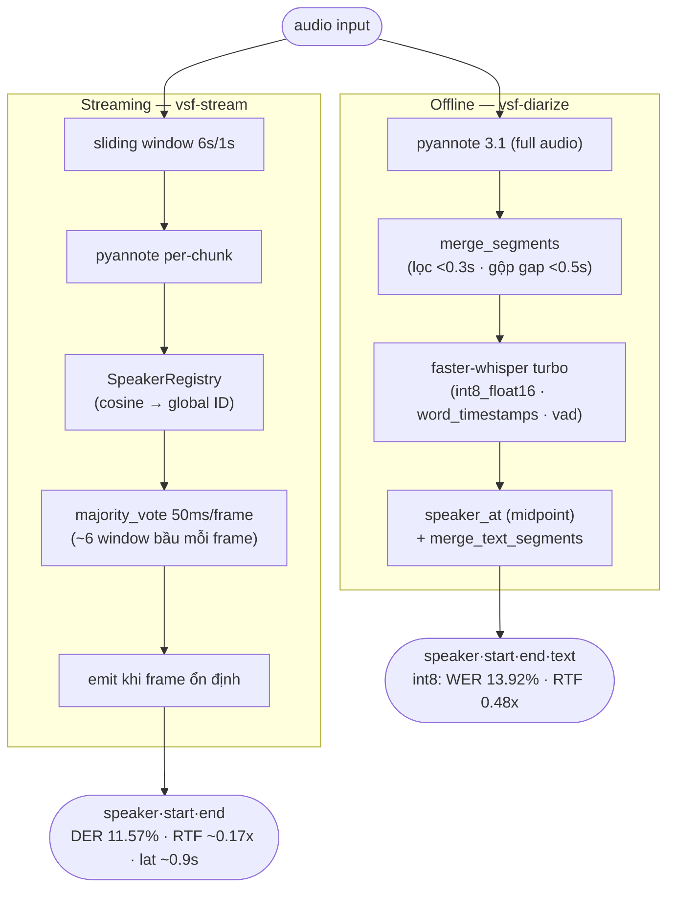

# Báo cáo: Hệ thống Diarization + ASR Tiếng Việt

> Đánh giá chất lượng trên **toàn bộ folder `test/`** (11 file, ground truth reviewed), GPU GTX 1650 (CUDA 12.8, torch 2.11+cu128). Gồm 2 phần: **nghiên cứu** (offline vs streaming — mục 4–6) và **triển khai** (real-time engine, API, web UI, observability, CI — mục 7).

---

## 1. Tổng quan

Pipeline "ai nói câu gì" cho tiếng Việt, so sánh 2 chiến lược:
1. **Offline** — pyannote xử lý toàn bộ audio 1 lần, Whisper/Qwen3 nhận dạng từng đoạn.
2. **Online (streaming)** — sliding window diart-style, emit dần để phục vụ real-time.

**Kết quả cốt lõi:** online streaming là chiến lược **diarization tốt nhất** (DER 11.67% vs offline raw 14.72%, thắng 7/11; adaptive per-file GT-free 9.65%); offline cho **WER thấp nhất** (11.84% float16) nhờ ngữ cảnh full-audio + word-timestamp; streaming end-to-end chạy real-time (RTF < 1, latency ~0.9s) đổi lại WER cao hơn.

---

## 2. Kiến trúc



**So sánh (đo toàn bộ folder `test/`; WER/RTF ở `float16` accuracy-mode — mặc định `int8_float16` nhanh 2.6×, WER +2%, xem mục 6; DER không phụ thuộc compute_type):**

| Chiến lược | DER | WER | RTF full pipeline | Latency |
|---|---:|---:|---:|---|
| Offline diarization (pyannote raw) | 14.72% | — | — | batch |
| Offline pipeline (pyannote + Whisper word-align) | 9.55% | **11.84%** | ~1.3x | batch |
| Online diar-only fixed w6 (batch) | 11.67% | — | — | — |
| **Online adaptive per-file (offline-agreement)** | **9.65%** | — | — | — |
| **Streaming end-to-end (w6 + Whisper)** | 11.57% | 19.25% | **0.97x** | **~0.9s** |

**Hai chế độ streaming:** `run_online()` (batch, trả hết segment cùng lúc — dùng để đánh giá) và `stream_online()` (generator yield từng batch, latency ≈ chunk × RTF — dùng thực tế). Offline chi tiết: pyannote full-audio → `merge_segments` → Whisper `word_timestamps` → gán speaker theo midpoint từng từ → `merge_text_segments`.

---

## 3. Cấu trúc & ghi chú kỹ thuật

Code trong package `vsf_diarization/` (`core` · `pipelines` · `serve` · `eval`) — cây thư mục đầy đủ xem [README.md](README.md). Chọn script: `vsf-diarize` (inference offline), `vsf-stream` (streaming), `vsf-evaluate`/`vsf-eval-streaming` (đánh giá có GT), `eval.eval_asr_models` (benchmark ASR thuần), `eval.compare_diarization` (offline vs online).

**Lỗi dev-time đã xử lý:**
- **soundfile thay torchaudio** (torchaudio 2.11 dùng torchcodec cần FFmpeg DLL không có) → đọc WAV bằng `soundfile`, truyền waveform dict.
- **Qwen3-ASR** không có trong transformers → package riêng `pip install qwen-asr`.
- **speaker_at fallback** (từ ở khoảng trống → speaker gần nhất, không "UNKNOWN") · **online Miss 39% → frame-level majority voting** (mục 5.3).

---

## 4. Đánh giá ASR — Whisper turbo vs Qwen3-ASR-1.7B

### 4.1 Whisper full-audio (pyannote + gán speaker per-word), float16

| File | Dur | DER | WER | CER | RTF |
|------|--:|--:|--:|--:|--:|
| test01 | 46s | 3.32% | **2.12%** | 1.77% | 1.16x |
| test02 | 51s | 32.79% | 1.72% | 1.06% | 1.31x |
| test03 | 197s | 7.30% | 19.63% | 15.01% | 1.17x |
| test04 | 93s | 7.82% | 11.32% | 8.87% | 1.07x |
| test05 | 83s | 14.26% | 33.44% | 34.77% | 1.61x |
| test06 | 85s | 2.50% | 6.25% | 3.16% | 1.34x |
| test07 | 51s | 29.36% | 13.51% | 8.84% | 1.11x |
| test08 | 74s | **0.00%** | 16.44% | 12.24% | 2.15x |
| test09 | 94s | 7.67% | 19.67% | 13.55% | 1.31x |
| test10 | 52s | **0.00%** | 1.97% | 1.48% | 1.14x |
| test11 | 49s | **0.00%** | 4.14% | 1.29% | 1.19x |
| **Mean (float16)** | | **9.55%** | **11.84%** | **9.28%** | ~1.3x |
| **Mean (int8 mặc định)** | | **11.08%** | **13.92%** | **10.32%** | **0.48x** |

> DER đây là **pipeline đầy đủ** (thấp hơn pyannote raw ở mục 5.2 nhờ gán lại theo word-timestamp).
> test02/07 DER cao do Confusion (clustering toàn cục tách nhầm 2 giọng giống nhau — online sửa được).
> test05 WER 33% do nội dung chuyên môn / phát âm khác biệt.

### 4.2 Benchmark ASR có kiểm soát (cắt đúng GT segment → WER thuần, tách khỏi diarization)

| Model | Params | Mean WER | Mean CER | Mean RTF | Thắng/11 |
|-------|--:|--:|--:|--:|:--:|
| Whisper turbo (vad) | 809M | 23.47% | 18.69% | **1.06x** | 3 |
| **Qwen3-ASR-1.7B** | 1.7B | **18.46%** | **13.91%** | 1.11x | **8** |
| Nemotron-3.5-streaming-0.6b | 0.6B | _N/A_ | — | — | — |

Per-file Qwen thắng 8/11 (test02/04/05/06/07/08/09 + test03), Whisper thắng test01/10/11.

**Nhận xét & chọn model:**
- **Qwen3-ASR** chính xác nhất trên đoạn ngắn isolated (18.46%) nhưng chậm (RTF 1.11x) và **không có word timestamp** → không gán speaker word-level.
- **Whisper turbo** yếu per-segment (23.47%, hay hallucinate) nhưng **full-audio đạt 11.84%** nhờ ngữ cảnh dài, có **word timestamp** → chọn cho pipeline. Chỉ cần ASR per-utterance → Qwen3.
- **Nemotron-3.5-0.6b** — model *duy nhất thiết kế gốc cache-aware streaming* (latency 80ms–1s), kỳ vọng nhanh nhất nhưng **chưa chạy được trên Windows** (NeMo `transcribe()` lỗi; adapter đã viết đúng, chạy trên Linux/WSL — mục 7–8).

---

## 5. So sánh chiến lược Diarization

### 5.1 Tinh chỉnh window × threshold (diarization thuần, không phụ thuộc ASR)

| window | threshold | mean DER | Confusion | Ghi chú |
|--:|--:|--:|--:|---|
| **9s** | **0.70** | **10.53%** | 6.93% | chính xác nhất cố định |
| 6s | 0.70 | 11.67% | 8.18% | **default** (latency ~0.9s) |
| 9s | 0.80 | 14.86% | 11.28% | 0.80 over-split |
| 4s | 0.70 | 15.58% | 12.63% | window quá ngắn |
| 6s | 0.80 | 16.94% | 13.42% | — |

`window=9s` chính xác hơn w6 (2 file fail ở w6 — test04/09 — được w9 sửa) nhưng **latency cao hơn** (~1.35s vs 0.9s) → **default giữ w6**, dùng w9 khi cần accuracy batch. Threshold 0.80 luôn tệ hơn.

**Adaptive per-file (GT-free "offline-agreement"):** chạy offline làm reference R, chọn window `argmin DER(R, O_w)` — không cần nhãn, dùng được lúc deploy.

| Chiến lược chọn window | mean DER |
|---|---:|
| **Adaptive (GT-free)** | **9.65%** (chọn đúng oracle 7/11) |
| Oracle (min theo GT) | 8.26% (trần lý thuyết) |
| Fixed w9 | 10.53% |
| Fixed w6 (default) | 11.67% |

> Adaptive **9.65% < w9 10.53%**, ≈ offline pipeline (9.55%). Hướng cải thiện: thay reference offline bằng tín hiệu nội tại (entropy nhãn / tách biệt centroid) để bắt test02/07. *(Thử duration-weighted embedding cho SpeakerRegistry → kết quả giống hệt baseline khi num_speakers=2 cố định; đã revert.)*

### 5.2 Offline vs Online streaming (default w6)

| File | Dur | Offline DER | Online DER | Winner |
|------|--:|--:|--:|:--:|
| test01 | 46s | 11.92% | **6.65%** | Online |
| test02 | 51s | 32.83% | **2.47%** | Online |
| test03 | 197s | **8.97%** | 15.35% | Offline |
| test04 | 93s | **15.68%** | 32.63% | Offline |
| test05 | 83s | 20.63% | **15.65%** | Online |
| test06 | 85s | **2.58%** | 5.16% | Offline |
| test07 | 51s | 34.61% | **5.57%** | Online |
| test08 | 74s | 22.57% | **8.77%** | Online |
| test09 | 94s | **10.53%** | 35.82% | Offline |
| test10 | 52s | 1.47% | **0.16%** | Online |
| test11 | 49s | 0.17% | **0.09%** | Online |
| **Mean** | | **14.72%** | **11.67%** | **Online 7/11** |

Online: Miss 1.66% (vs 5.12%), FA 1.82% (vs 3.07%), Confusion 8.18% (vs 6.53%). RTF ~0.17x vs ~0.09x.

**Phân tích:**
- **Online thắng** nhờ (1) tránh clustering toàn cục — test02/07 offline conf ~30% → online 2.47/5.57%; (2) giảm Miss nhờ cửa sổ chồng lấp — test08 monologue 22.57% → 8.77%.
- **Offline thắng 4 ca biên:** test04/09 (2 giọng bị map nhầm embedding trong cửa sổ 6s → **w9/adaptive sửa được**); test03 (hội thoại lệch, SPEAKER_01 chỉ 10% toàn backchannel <0.5s → majority-vote nuốt mất — giới hạn thật của streaming); test06 (ghost speaker thoáng qua).

### 5.3 Thuật toán `stream_online()` (majority voting + generator)

```python
# Mỗi window bầu cho từng frame 50ms (chunk=6s/step=1s → ~6 window/frame)
for t, _, spk in annotation.itertracks():
    for fi in range(int((t.start+offset)/FRAME_DUR), int((t.end+offset)/FRAME_DUR)+1):
        votes[fi][global_spk] += 1
winner = max(votes[fi], key=votes[fi].get)      # thắng theo đa số

# Emit khi ổn định: sau window tại pos, frame trước pos không nhận thêm vote → yield ngay
new_emit_fi = int((pos/SAMPLE_RATE)/FRAME_DUR)
yield _frames_to_segs([(fi*FRAME_DUR, winner(fi)) for fi in range(emit_fi, new_emit_fi)])
```

~6 window/frame loại Miss (mọi frame được xử lý), giảm FA (silence không có vote), giảm noise biên (đa số thắng nhãn sai 1–2 window). Batch mode có thêm `limit_speakers()` merge ghost speaker.

### 5.4 Streaming end-to-end (diarization + ASR)

*`vsf-stream` dùng chung `stream_online()`. Turn ≥ `min_asr` (1.0s) → Whisper; ngắn hơn → `"..."` (tránh hallucinate); <0.3s bị loại. Bảng float16.*

| File | DER | WER | CER | coverage | RTF |
|------|--:|--:|--:|:--:|--:|
| test01 | 7.04% | 24.34% | 20.13% | 94.2% | 1.12x |
| test02 | 2.03% | 13.36% | 11.43% | 100% | 0.71x |
| test03 | 14.74% | 24.97% | 18.42% | 100% | 0.80x |
| test04 | 33.18% | 42.05% | 37.42% | 98.8% | 1.02x |
| test05 | 14.94% | 25.17% | 20.78% | 98.0% | 1.46x |
| test06 | 5.16% | 14.32% | 10.30% | 100% | 1.08x |
| test07 | 5.57% | 16.22% | 11.47% | 100% | 0.87x |
| test08 | 8.57% | 18.79% | 12.33% | 100% | 1.10x |
| test09 | 35.82% | 24.86% | 17.67% | 99.6% | 0.83x |
| test10 | 0.16% | 2.96% | 2.17% | 100% | 0.58x |
| test11 | 0.09% | 4.73% | 1.67% | 100% | 0.47x |
| **Mean (float16)** | **11.57%** | **19.25%** | **14.89%** | **99.15%** | **0.97x** |
| **Mean (int8 mặc định)** | 11.57% | 19.79% | 15.41% | 99.15% | 0.65x |

- **Diarization khớp chuẩn:** DER 11.57% ≈ online-batch 11.67% (tái lập đúng thuật toán).
- **WER xếp giữa** offline 11.84% và per-GT-segment 23.47%: gộp turn cùng speaker cho Whisper nhiều ngữ cảnh hơn per-segment, nhưng vẫn mất ngữ cảnh xuyên turn.
- **`min_asr` không phải nguyên nhân chính:** coverage 99.15% → WER chủ yếu do lỗi ASR + hallucinate turn 1–1.5s.
- **Real-time:** RTF 0.65x (int8) < 1 nhờ bỏ ASR turn ngắn + gộp turn. int8 chỉ +0.5 WER ở streaming (nhẹ hơn offline +2).

---

## 6. Benchmark RTF (GTX 1650) & lượng tử hoá

| Task | RTF | Latency |
|------|--:|---|
| Diarization offline | ~0.08x | batch |
| Diarization streaming w6 | ~0.14x | ~0.9s |
| ASR+Diar offline **int8 (mặc định)** | **~0.48x** | batch |
| ASR+Diar offline float16 | ~1.3x | batch |
| ASR+Diar offline Qwen3 | ~3–4x | batch |

### int8_float16 (mặc định) vs float16

| Metric (mean) | float16 | **int8_float16** | Δ |
|---|--:|--:|---|
| **RTF** | 1.24x | **0.48x** | 🟢 nhanh 2.6× |
| WER | **11.84%** | 13.92% | +2.08 |
| DER | **9.55%** | 11.08% | +1.53 |
| CER | **9.28%** | 10.32% | +1.05 |

> **Mặc định int8_float16** (real-time); `--compute-type float16` cho accuracy tối đa, int8_float16 là trade-off tốt nhất.

---

## 7. Triển khai: real-time, API & observability

Đưa pipeline nghiên cứu thành dịch vụ chạy được.

- **Engine real-time `StreamingSession`** (`core/streaming_session.py`): tổng quát hoá `stream_online()`sang input tăng dần — `feed(chunk) → [turn]` · `finalize()`, votes lưu dict thưa (bộ nhớ không phình). **Kiểm chứng tương đương** trên test01: feed block 0.5s cho DER 7.04% ≈ reference 7.16%. Mic thật: `vsf-stream --source mic --live`.
- **API `vsf-serve`** (FastAPI, model cache load 1 lần): `POST /transcribe` (validate định dạng+size → 400/413/422), `WS /ws/stream` (PCM real-time), `GET /health` (liveness) vs `/ready` (readiness = model nạp + GPU sống → 200/503, hợp k8s probe), `/metrics(/prometheus)`, `/` web UI, `/demo` Gradio.
- **Web UI** (`serve/static/`, vanilla JS): upload/mic real-time, transcript tô màu, **audio player đồng bộ + timeline + đổi tên speaker + xuất TXT/SRT/VTT/CSV/JSON**, caption "đang nghe…", dashboard.
- **Observability** (`serve/observability.py`): logging có cấu trúc + Prometheus (`vsf_requests_total`, `vsf_request_seconds`, `vsf_rtf`, `vsf_active_ws_sessions`, `vsf_gpu_memory_bytes`…). Full-stack 1 lệnh: `docker compose -f monitoring/docker-compose.yml up --build` (App + Prometheus + Grafana dashboard nạp sẵn).
- **Chất lượng & CI:** test thuần (fake pipeline, không cần GPU/model) phủ metric + `StreamingSession` (feed-block = feed-cả-mảng) + endpoint; CI chạy **ruff + mypy + pytest** trên CPU mỗi push/PR.

---

## 8. Hướng phát triển & hạn chế

**Phát triển (không train):** enrollment speaker (voiceprint DB, cosine sẵn) tự gán tên; lọc `no_speech_prob`/`avg_logprob` giảm WER streaming; ; auth + rate limit. **Có train:** benchmark Nemotron trên WSL; fine-tune Whisper y tế; fine-tune pyannote embedding tiếng Việt (DER < 8%).

**Hạn chế:** int8 mặc định +2% WER (đổi lấy RTF 0.48x); Nemotron chưa đo trên Windows (cần WSL); bộ test còn nhỏ (11 file).

---

## 9. Sample Output

```
[00:00:00.000 → 00:00:07.500]  SPEAKER_01 : <câu hỏi của người nói A>
[00:00:07.500 → 00:00:08.360]  SPEAKER_00 : <trả lời của người nói B>
[00:00:08.420 → 00:00:09.100]  SPEAKER_01 : <backchannel>
```
