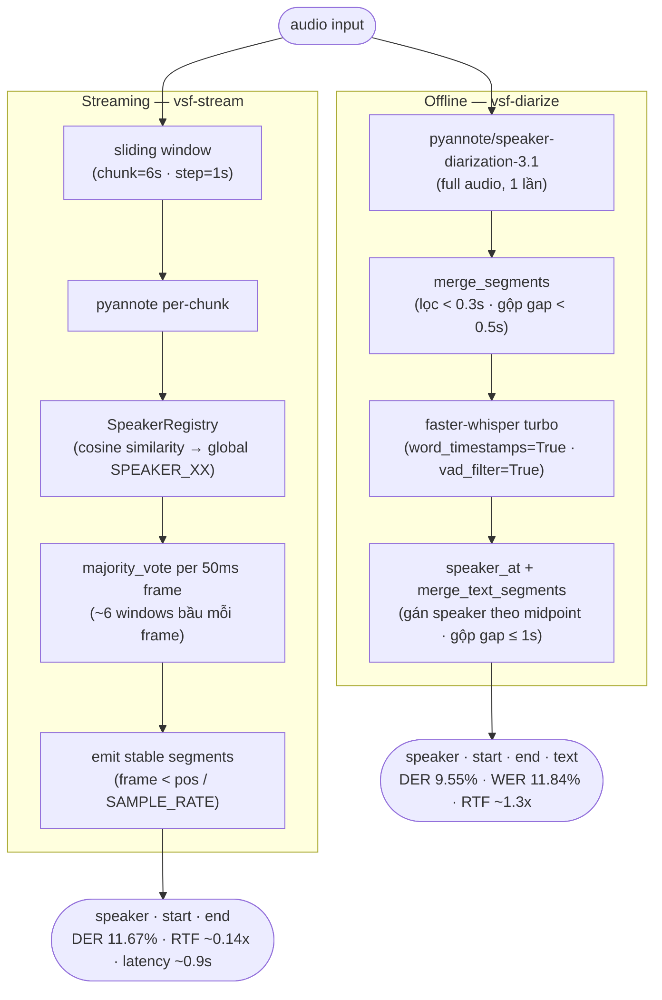
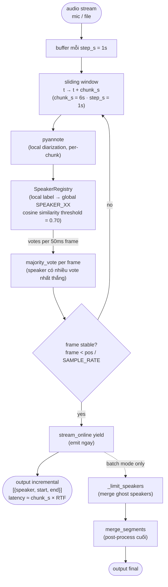

# Báo cáo: Hệ thống Diarization + ASR Tiếng Việt

> Cập nhật lần cuối: 2026-06-22 (sửa lỗi timestamp GT test03 + thêm adaptive per-file window; 11 file reviewed test01–test11, ~877s)

---

## 1. Tổng quan

Xây dựng và đánh giá pipeline nhận dạng giọng nói + phân biệt người nói (speaker diarization) cho tiếng Việt. Chạy trên GPU NVIDIA GTX 1650 (CUDA 12.8, torch 2.11.0+cu128).

**Mục tiêu:** So sánh hai chiến lược:
1. **Offline** — pyannote xử lý toàn bộ audio một lần, Whisper hoặc Qwen3-ASR nhận dạng từng đoạn.
2. **Online (streaming)** — sliding window diart-style: xử lý từng cửa sổ ngắn, emit kết quả dần dần để phục vụ real-time.

---

## 2. Kiến trúc hệ thống

### 2.1 Pipeline toàn bộ — tổng quan



**So sánh hai chiến lược (đo trên 11 file GT reviewed test01–test11, ~877s):**

| Chiến lược | DER | WER | RTF diarization | RTF full pipeline | Latency output |
|---|---:|---:|---:|---:|---|
| Offline diarization (pyannote raw, full-audio) | 14.72% | — | ~0.09x | — | batch |
| Offline pipeline (pyannote + Whisper word-align) | 9.55% | **11.84%** | — | ~1.3x | batch |
| Online diarization-only fixed w6 (chunk=6s, batch) | 11.67% | — | **~0.17x** | — | — |
| **Online adaptive per-file window (offline-agreement)** | **9.65%** | — | ~0.5x* | — | — |
| **Streaming end-to-end (chunk=6s + Whisper)** | 11.57% | 19.25% | — | **0.97x** | **~0.9s** |

*Trung bình trên 11 file GT reviewed. **Online vẫn là chiến lược streaming tốt nhất** — fixed w6 DER 11.67% vs offline raw 14.72%, thắng 7/11 file (mục 6.2); **adaptive per-file window (chọn window GT-free) hạ xuống 9.65%** ≈ offline pipeline, vượt mọi window cố định (mục 6.1). Pipeline offline cho WER thấp nhất (11.84%) nhờ ngữ cảnh full-audio + word-timestamp; streaming end-to-end chạy real-time (RTF 0.97x) đổi lại WER cao hơn (19.25%, mục 6.5).*

> *Adaptive RTF ~0.5x do chạy offline tham chiếu + nhiều window để chọn; nếu chỉ chạy window đã chọn thì ~0.17x. Streaming end-to-end (diarization + ASR real-time) **đã tích hợp** trong `vsf-stream` (`pipeline_streaming.py`, dùng chung `stream_online()` + Whisper per-turn): output `{speaker, start, end, text}`, DER 11.57% · WER 19.25% · RTF 0.97x — xem **mục 6.5**.

---

### 2.2 Pipeline offline chi tiết (vsf-diarize)


### 2.3 Pipeline online streaming (vsf-stream / eval.compare_diarization)



**Hai chế độ hoạt động:**

| Mode | Hàm | Output | Latency | Dùng khi |
|------|-----|--------|---------|----------|
| Batch | `run_online()` | Tất cả segments cùng lúc | Sau khi xử lý hết file | Đánh giá / compare |
| **Streaming** | `stream_online()` | Generator yield từng batch | ≈ chunk_s × RTF | **Ứng dụng thực tế** |

---

## 3. Cấu trúc file

Code đóng gói trong package `vsf_diarization/` (cài `pip install -e .` → lệnh `vsf-*`).

```
vsf_diarization/                # ← Python package
│  ── core/ — module dùng chung (import) ─────────────────────
├── core/diarize_offline.py     # run_offline(): pyannote full-audio → (segments, elapsed)
├── core/diarize_online.py      # run_online() + stream_online(): sliding window + majority vote
├── core/utils.py               # load_audio, load_models, whisper/qwen_transcribe, compute_der, load_gt, iter_wavs
│
│  ── pipelines/ — entry points inference ──────────────────────
├── pipelines/pipeline.py            # vsf-diarize : offline diarization (+ASR) --asr none|whisper|qwen
├── pipelines/pipeline_streaming.py  # vsf-stream  : streaming real-time; --no-asr = chỉ diarization
│
│  ── eval/ — evaluation & comparison ─────────────────────────
├── eval/evaluate.py            # vsf-evaluate : offline vs GT — DER, WER, CER (+Qwen)
├── eval/eval_streaming.py      # vsf-eval-streaming : streaming end-to-end vs GT
├── eval/compare_diarization.py # Offline vs online diarization (DER vs GT)
├── eval/sweep_online.py        # Quét window × threshold (load model 1 lần)
├── eval/adaptive_window.py     # Chọn window per-file GT-free (offline-agreement) → 9.65%
├── eval/sweep_streaming.py     # Quét min_asr cho streaming
├── eval/eval_asr_models.py     # Benchmark ASR per-segment Whisper|Qwen|Nemotron (self-contained)
├── eval/compare_asr_3models.py # In bảng 3 model từ outputs/asr_*.json (không GPU)
└── create_ground_truth.py      # vsf-create-gt : tạo draft GT để annotate tay

pyproject.toml                  # metadata + deps + entry points vsf-*
Dockerfile / .dockerignore      # image GPU CUDA 12.8
run_nemotron.sh                 # Nemotron benchmark (WSL2)
ground_truth/ · test/ · outputs/  # dữ liệu runtime (.gitignore)
```

**Lưu ý về overlap giữa scripts:**
| Lệnh | Mô tả | Khi nào dùng |
|--------|--------|--------------|
| `vsf-evaluate` | Đầy đủ nhất: chạy pipeline offline + so sánh GT + tùy chọn Qwen3 | Đánh giá chất lượng có GT |
| `eval.eval_asr_models` | Benchmark ASR thuần per-segment (Whisper/Qwen/Nemotron) | So WER các model trên cùng audio |
| `eval.compare_diarization` | Offline vs Online diarization, có GT | Đánh giá chiến lược diarization |
| `vsf-diarize --asr none\|whisper\|qwen` | Inference offline 1 file | Chạy thực tế (diarization + ASR) |

---

## 4. Ghi chú kỹ thuật (lỗi dev-time đã xử lý)

- **soundfile thay torchaudio**: torchaudio 2.11 dùng torchcodec (cần FFmpeg DLL không có sẵn) → đọc WAV bằng `soundfile` + waveform dict `{"waveform", "sample_rate"}`.
- **Qwen3-ASR**: không có architecture trong transformers → cài package riêng `pip install qwen-asr`.
- **speaker_at fallback** (từ nằm khoảng trống → gán speaker gần nhất, không trả "UNKNOWN") · **merge_text_segments** (gộp fragment cùng speaker gap ≤ 1s) · **online Miss 39% → frame-level majority voting** (mục 6).

---

## 5. Đánh giá ASR — Whisper turbo vs Qwen3-ASR-1.7B

*Đo trên 11 file ground truth đã reviewed: test01–test11 (tổng ~877s hội thoại tiếng Việt). Diarization: pyannote offline + gán speaker theo word-timestamp của Whisper, num_speakers từ GT.*

### 5.1 Whisper turbo (pyannote + faster-whisper turbo)

| File | Duration | DER | Miss | FA | Conf | WER | CER | RTF |
|------|------:|----:|-----:|---:|-----:|----:|----:|----:|
| test01.wav | 46s | 3.32% | 0.1% | 0.0% | 3.2% | **2.12%** | **1.77%** | 1.16x |
| test02.wav | 51s | 32.79% | 0.8% | 0.0% | 32.0% | 1.72% | 1.06% | 1.31x |
| test03.wav | 197s | 7.30% | 1.0% | 0.7% | 5.6% | 19.63% | 15.01% | 1.17x |
| test04.wav | 93s | 7.82% | 2.7% | 2.4% | 2.7% | 11.32% | 8.87% | 1.07x |
| test05.wav | 83s | 14.26% | 0.6% | 6.8% | 6.9% | 33.44% | 34.77% | 1.61x |
| test06.wav | 85s | 2.50% | 1.5% | 0.0% | 1.0% | 6.25% | 3.16% | 1.34x |
| test07.wav | 51s | 29.36% | 0.2% | 0.0% | 29.1% | 13.51% | 8.84% | 1.11x |
| test08.wav | 74s | **0.00%** | 0.0% | 0.0% | 0.0% | 16.44% | 12.24% | 2.15x |
| test09.wav | 94s | 7.67% | 0.0% | 2.9% | 4.8% | 19.67% | 13.55% | 1.31x |
| test10.wav | 52s | **0.00%** | 0.0% | 0.0% | 0.0% | 1.97% | 1.48% | 1.14x |
| test11.wav | 49s | **0.00%** | 0.0% | 0.0% | 0.0% | 4.14% | 1.29% | 1.19x |
| **Trung bình** | ~877s | **9.55%** | — | — | — | **11.84%** | **9.28%** | **~1.3x** |

> Đây là DER của **pipeline đầy đủ** (pyannote + gán speaker per-word của Whisper). test08/10/11 đạt DER 0% vì là monologue / hội thoại rõ ràng + word-align làm sạch biên. Lưu ý DER này thấp hơn DER của **pyannote thô** (mục 6.2) do bước gán lại theo word-timestamp.

> **test02 & test07** — DER cao (32.79% / 29.36%) hầu hết là Confusion (~30%): clustering toàn cục của pyannote tách nhầm 2 giọng giống nhau. Online streaming sửa được cả hai (mục 6.2).

> **test03** — DER giảm mạnh **33.14% → 7.30%** sau khi sửa **lỗi timestamp trong GT**: 1 segment SPEAKER_00 (`"Bố mẹ nói…"`) ghi nhầm `start=106.7` (trùng start segment trước đó 73s) trong khi `end=195.8`, khiến SPEAKER_00 tự overlap ~73s → đẩy Miss giả lên ~28.7%. Sửa `start=180.0`. WER 19.63% giữ nguyên (text không đổi). Audio test03 thực ra diarize tốt — không phải lỗi audio như nghi vấn ban đầu.

> **test05** — WER 33.44%, CER 34.77%: nội dung có nhiều thuật ngữ chuyên môn hoặc phát âm khác biệt khiến Whisper nhận nhầm nhiều. DER 14.26% chủ yếu do FA 6.84%.

> ⚠️ Báo cáo các bản trước ghi Mean WER 3.36% (3 file) / 12.41% (6 file) — đều chỉ đúng cho subset. Trên bộ **11 file test01–11**, Mean WER thực là **11.84%**, Mean CER **9.28%**.

### 5.2 Benchmark ASR có kiểm soát — Whisper vs Qwen3 vs Nemotron 3.5

*Cập nhật 2026-06-18 (11 file test01–test11). Phương pháp: cắt audio theo **đúng ranh giới segment trong ground truth** rồi đưa từng đoạn cho model — mọi model thấy audio giống hệt với ranh giới lý tưởng, nên WER/CER đo **chất lượng nhận dạng thuần**, tách khỏi diarization. Khác với mục 5.1 (Whisper full-audio qua pyannote turns). Script: `eval_asr_models.py --model {whisper,qwen,nemotron}`.*

| Model | Params | Mean WER | Mean CER | Mean RTF | Thắng/11 |
|-------|-------:|---------:|---------:|---------:|:-------:|
| Whisper turbo (vad=True) | 809M | 23.47% | 18.69% | **1.06x** | 3 |
| **Qwen3-ASR-1.7B** | 1.7B | **18.46%** | **13.91%** | 1.11x | **8** |
| Nemotron-3.5-streaming-0.6b | 0.6B | _N/A (xem ghi chú)_ | — | — | — |

**Per-file WER (controlled, theo GT segment):**

| File | Số segment | Whisper | Qwen3 | Thắng |
|------|:----:|--------:|------:|:-----:|
| test01 | 17 | **11.64%** | 14.81% | Whisper |
| test02 | 2 | 5.60% | **3.45%** | Qwen |
| test03 † | 26 | 77.27% | **70.19%** | (số pre-fix, xem †) |
| test04 | 16 | 31.27% | **18.33%** | Qwen |
| test05 | 16 | 34.11% | **20.86%** | Qwen |
| test06 | 7 | 11.46% | **8.07%** | Qwen |
| test07 | 2 | 17.57% | **8.56%** | Qwen |
| test08 | 1 | 18.79% | **15.44%** | Qwen |
| test09 | 21 | 41.53% | **27.60%** | Qwen |
| test10 | 1 | **2.46%** | 3.94% | Whisper |
| test11 | 1 | **6.51%** | 11.83% | Whisper |
| **Trung bình** | — | 23.47% † | **18.46%** † | **Qwen 8/11** |

> † **test03 pre-fix:** số đo per-segment này lấy trước khi vá lỗi timestamp GT. Segment lỗi cắt 89s audio (106.7→195.8) nhưng chỉ khớp ~16s text → insertion khổng lồ, thổi WER test03 lên 77/70% và kéo cả mean lên. ASR thực của test03 phản ánh đúng hơn ở **full-audio WER 19.63%** (mục 5.1). Chưa re-chạy per-segment cho test03 (Qwen chậm); mean sau khi vá sẽ thấp hơn 23.47/18.46.

**Nhận xét điểm mạnh / điểm yếu:**

*Qwen3-ASR-1.7B — chính xác nhất trên đoạn ngắn isolated:*
- Thắng 8/11 file, WER per-segment 18.46% (thấp hơn Whisper ~5 điểm). Đặc biệt mạnh ở file nhiều turn ngắn / hội thoại nhanh (test04 18.33% vs Whisper 31.27%; test07 8.56% vs 17.57%).
- **Điểm yếu:** chậm (RTF 1.11x > 1, model 1.7B), **không có word timestamp** → không gán speaker theo từng từ được (phải gán per-segment), không phù hợp pipeline diarization word-level.

*Whisper turbo — mạnh khi có ngữ cảnh dài, yếu trên đoạn ngắn:*
- Per-segment chỉ 23.47%, NHƯNG **full-audio (mục 5.1) đạt 11.84%** — Whisper khai thác ngữ cảnh dài rất tốt. Khi cắt thành đoạn ngắn isolated, Whisper hay hallucinate (test08 monologue: vad=True cứu từ 27% xuống 18.79%). Thắng ở file 1 segment dài (test10/test11).
- **Điểm mạnh quyết định cho pipeline:** có **word timestamp** → gán speaker theo midpoint từng từ (mục 2.2), nhanh nhất (RTF ~1.0–1.3x). Đây là lý do pipeline offline dùng Whisper.

*test03 — số fail (Whisper 77.27%, Qwen 70.19%) là do LỖI GT, không phải model/audio:*
- Cùng thủ phạm với diarization: lỗi timestamp khiến 1 GT segment cắt 89s audio nhưng chỉ có ~16s text → khi benchmark per-segment, model "đọc" cả 89s nhưng bị chấm với 16s text → insertion error khổng lồ. **Đã vá** (start 106.7→180.0). Full-audio WER test03 chỉ 19.63% (mục 5.1) → audio + model đều ổn. Bài học: per-segment benchmark cực nhạy với lỗi biên GT.

**Kết luận chọn model:**
- **Pipeline đầy đủ (diarization + transcript): Whisper turbo** vẫn tốt nhất — full-audio WER 11.84%, có word timestamp để gán speaker, nhanh.
- **Nếu chỉ cần ASR per-utterance: Qwen3-ASR** chính xác hơn (18.46% vs 23.47%), đổi lại chậm hơn và không có word timestamp.

**Khuyến nghị cho streaming (ưu tiên độ trễ thấp + xử lý theo chunk):**

| Tiêu chí streaming | Nemotron-3.5-0.6b | Qwen3-ASR-1.7b | Whisper turbo |
|---|:---:|:---:|:---:|
| Thiết kế streaming gốc | ✅ cache-aware, latency 80ms–1s | ❌ per-utterance batch | ❌ cửa sổ 30s |
| Độ chính xác đoạn ngắn | _chưa đo_ | ✅ tốt nhất (18.46%) | ⚠️ 23.47% |
| Tốc độ (RTF, GTX 1650) | _chưa đo_ (0.6B → kỳ vọng < 1) | ⚠️ 1.11x | ⚠️ 1.06x |
| Word timestamp (gán speaker incremental) | tùy | ❌ | ✅ |
| Chạy trên Windows | ❌ (cần Linux/WSL) | ✅ | ✅ |

- **Lựa chọn lý tưởng cho streaming: Nemotron-3.5-streaming-0.6b** — đây là model *duy nhất thiết kế gốc cho cache-aware streaming* (latency có thể chỉnh 80ms–1s), nhỏ nhất (0.6B → kỳ vọng RTF < 1, nhanh hơn cả Qwen/Whisper). **Cần chạy trên Linux/WSL** (mục 8.1) để đo và tích hợp.
- **Lựa chọn khả dụng ngay (Windows): Whisper turbo** cho streaming pipeline — RTF ~1.0 + **word timestamp** cho phép emit `(speaker, text)` incremental cùng `stream_online()`. Đổi lại WER đoạn ngắn cao hơn Qwen.
- Qwen3 chính xác hơn per-chunk nhưng RTF > 1 và thiếu word timestamp → ít phù hợp low-latency streaming dù WER thấp hơn.

> ⚠️ **Nemotron-3.5-ASR-Streaming-0.6B — chưa benchmark được trên Windows.** Model (NVIDIA, 06/2026, hỗ trợ vi-VN, kiến trúc FastConformer cache-aware RNNT + prompt) **cài và load thành công** trên Windows (sau khi: cài NeMo từ `git@main` để có class `EncDecRNNTBPEModelWithPrompt`, và ép lại torch/torchaudio **cu128** vì NeMo kéo về bản CPU làm hỏng `libtorchaudio.pyd`). Tuy nhiên **đường inference `transcribe()` của NeMo hỏng trên Windows native**: input numpy → decode rỗng; input file → lỗi khóa file manifest tạm (`PermissionError WinError 32`) + plumbing prompt hướng-training. Adapter đã viết đúng API (`target_lang="vi-VN"`) trong `eval_asr_models.py`, **chạy được trên Linux/WSL**. Xem mục 8.1 để biết hướng chạy.

---

## 6. So sánh chiến lược Diarization

### 6.1 Tinh chỉnh hyper-parameter online (window × threshold)

Quét đầy đủ 6 cấu hình `window ∈ {4, 6, 9}s × threshold ∈ {0.70, 0.80}` trên cả **11 file** (step=1s, num_speakers từ GT). Script `sweep_online.py` load pipeline một lần và tái sử dụng cho mọi cấu hình.

| window | threshold | **mean DER** | mean Confusion | Ghi chú |
|-------:|----------:|-------------:|---------------:|---------|
| **9s** | **0.70** | **10.53%** | 6.93% | **Tối ưu (accuracy) trên bộ 11 file** |
| 6s | 0.70 | 11.67% | 8.18% | Default streaming (latency thấp ~0.9s) |
| 9s | 0.80 | 14.86% | 11.28% | threshold 0.80 gây over-split |
| 4s | 0.70 | 15.58% | 12.63% | Window quá ngắn → confusion tăng |
| 4s | 0.80 | 15.60% | 12.62% | — |
| 6s | 0.80 | 16.94% | 13.42% | threshold 0.80 thảm họa |

**Kết luận tinh chỉnh:** trên bộ **11 file** (sau khi sửa GT test03), `window=9s, threshold=0.70` là cấu hình cố định **chính xác nhất** (10.53%), vượt `window=6s` (11.67%). Lý do: **2 file fail ở w6** (test04, test09) được w9 sửa, kéo trung bình về phía w9. Threshold 0.80 luôn tệ hơn.

> ⚠️ **Trade-off cho streaming:** w9 chính xác hơn nhưng **latency cao hơn** (≈ chunk × RTF ≈ 9×0.15 ≈ **1.35s** vs w6 ≈ **0.9s**). Vì ưu tiên streaming là độ trễ thấp, **default vẫn giữ w6** (0.9s, DER 11.67%); dùng **w9 khi chạy batch/cần độ chính xác cao nhất** (10.53%).

**Headroom thực nằm ở adaptive per-file** — không giá trị cố định nào đạt được:

| File | window=4s | window=6s | window=9s | Tốt nhất |
|------|----------:|----------:|----------:|:--------:|
| test01 | 31.45% | **6.65%** | 13.15% | w6 |
| test02 | 7.50% | 2.47% | **0.58%** | w9 |
| test03 | **15.03%** | 15.35% | 16.20% | w4 |
| test04 | 31.37% | 32.63% | **18.33%** | w9 |
| test05 | 21.59% | **15.65%** | 25.30% | w6 |
| test06 | 7.87% | **5.16%** | 10.64% | w6 |
| test07 | 9.86% | 5.57% | **4.17%** | w9 |
| test08 | **8.64%** | 8.77% | 10.13% | w4 |
| test09 | 37.03% | 35.82% | **16.39%** | w9 |
| test10 | 0.55% | **0.16%** | 0.50% | w6 |
| test11 | 0.50% | **0.09%** | 0.40% | w6 |

> Chọn window tối ưu **theo từng file** (oracle) → mean DER xuống **8.26%**. Phân bố: w6 tốt nhất cho 5 file (test01/05/06/10/11), w9 cho 4 file (test02/04/07/09), w4 cho 2 file (test03/08).

**Adaptive per-file đã hiện thực hoá (`adaptive_window.py`) — heuristic GT-free "offline-agreement":** chạy offline pyannote 1 lần làm reference R, với mỗi window chạy online → chọn window mà output khớp R nhất (`argmin DER(R, O_w)`). Không cần nhãn tay nên dùng được lúc deploy.

| Chiến lược chọn window | mean DER | Ghi chú |
|---|---:|---|
| **Adaptive (offline-agreement, GT-free)** | **9.65%** | chọn đúng oracle 7/11 file; vượt mọi window cố định |
| Oracle (cheat — min theo GT) | 8.26% | trần lý thuyết |
| Fixed w9 (tốt nhất cố định) | 10.53% | |
| Fixed w6 (default) | 11.67% | |

> Adaptive **9.65% < w9 10.53%** — xuống dưới 10%, ≈ offline pipeline (9.55%). 4 ca chọn sai (test02/07 chọn w4 thay w9; test03/08) chỉ mất ~1–7 điểm/ca, không đủ xoá lợi thế. Hướng cải thiện: thay reference offline bằng tín hiệu ổn định nội tại (entropy gán nhãn / tách biệt centroid) để bắt được test02/07.

**Thử nghiệm cải tiến SpeakerRegistry (kết quả âm tính):** đổi cập nhật embedding từ *running-average theo số lần* sang *duration-weighted* cho kết quả **giống hệt** baseline khi `num_speakers=2` cố định (pyannote xuất đúng 2 embedding/cửa sổ, cosine-match không đổi). Đã revert để giữ code đơn giản.

### 6.2 Kết quả cuối: Offline vs Online streaming (default streaming w6)

*So sánh diarization thuần (không ASR): offline = pyannote raw turns; online = chunk=**6s** (default streaming, latency ~0.9s), step=1s, threshold=0.70, majority voting 50ms. num_speakers từ GT. Đo trên 11 file GT reviewed (test01–test11). Lưu ý: w9 hạ online mean DER xuống **10.53%**, adaptive per-file xuống **9.65%** (mục 6.1) nhưng latency/chi phí cao hơn.*

| File | Duration | avg turn | Offline DER | Online DER | Winner |
|------|------:|------:|----:|----:|:---:|
| test01 | 46s | 3.5s | 11.92% | **6.65%** | Online |
| test02 | 51s | 17.1s | 32.83% | **2.47%** | Online |
| test03 | 197s | 13.2s | **8.97%** | 15.35% | **Offline** |
| test04 | 93s | 3.6s | 15.68% | 32.63% | **Offline** |
| test05 | 83s | 4.0s | 20.63% | **15.65%** | Online |
| test06 | 85s | 9.5s | **2.58%** | 5.16% | **Offline** |
| test07 | 51s | 5.7s | 34.61% | **5.57%** | Online |
| test08 | 74s | 3.9s | 22.57% | **8.77%** | Online |
| test09 | 94s | 3.8s | 10.53% | 35.82% | **Offline** |
| test10 | 52s | 25.8s | 1.47% | **0.16%** | Online |
| test11 | 49s | 49.2s | 0.17% | **0.09%** | Online |
| **Trung bình** | ~877s | — | **14.72%** | **11.67%** | **Online 7/11** |

| Metric | Offline (pyannote raw) | Online streaming (chunk=6s) |
|--------|:-----------------:|:-------------------:|
| **DER mean (11 file)** | 14.72% | **11.67%** |
| — Miss mean | 5.12% | **1.66%** |
| — False Alarm mean | 3.07% | **1.82%** |
| — Confusion mean | **6.53%** | 8.18% |
| **RTF mean** | **~0.09x** | ~0.17x |
| Wall-clock latency | N/A (batch) | ~chunk × RTF ≈ 0.9s |
| Online wins / tổng | — | **7/11 file** |

### 6.3 Phân tích

**Kết quả tổng thể (11 file):** Online streaming vẫn là **chiến lược diarization tốt nhất** — mean DER 11.67% vs offline raw 14.72% (giảm ~21% tương đối), thắng **7/11 file**. Online giảm mạnh Miss (1.66% vs 5.12%) và False Alarm (1.82% vs 3.07%), nhưng **Confusion cao hơn** (8.18% vs 6.53%) — bị kéo bởi 2 ca fail (test04, test09).

**Vì sao online thắng — hai cơ chế chính:**

*1. Tránh lỗi clustering toàn cục (test02, test07):* pyannote offline gom cụm trên toàn file → khi 2 giọng giống nhau, nó tách nhầm rồi gán sai (test02 conf 32%, test07 conf 29% → DER ~33%). Online chỉ phân biệt trong từng cửa sổ 6s nơi embedding nhất quán → DER giảm còn 2.47%/5.57%.

*2. Giảm Miss nhờ cửa sổ chồng lấp (test05, test08):* mỗi frame được ~6 cửa sổ "bầu" nên ít bị bỏ sót. test08 (monologue 74s): offline DER 22.57% (miss nhiều) trong khi online phủ gần đủ → 8.77%.

**Các ca offline thắng (test03, test04, test06, test09):**

*test04 & test09 — online fail nặng (32.63% vs 15.68%; 35.82% vs 10.53%), confusion tăng vọt:*
- Cả hai có avg turn ngắn (~3.6–3.8s) + talk-time lệch: online gán nhầm danh tính 2 giọng ở một số cửa sổ 6s → confusion cao.
- ⚠️ **avg turn ngắn KHÔNG đủ giải thích:** test01 (3.5s), test05 (4.0s), test08 (3.9s) cũng turn ngắn nhưng online **thắng**. Yếu tố quyết định là *2 giọng trong test04/test09 bị pyannote map nhầm embedding trong cửa sổ ngắn* — tăng window lên 9s giảm được lỗi này (mục 6.1) nhưng hại file khác → cần adaptive per-file.

*test03 (197s) — đã sửa được phần lớn nhờ vá lỗi GT:*
- Trước đây cả hai đều ~34–39% với **Miss ~29% cố định ở mọi window** — dấu hiệu artifact GT chứ không phải thuật toán. Kiểm tra xác nhận: offline pyannote phủ 193.7/193.8s speech (chỉ sót 0.9s) → **audio diarize tốt**, không phải lỗi audio. Thủ phạm là **lỗi timestamp**: 1 segment SPEAKER_00 ghi `start=106.7` (đúng phải `180.0`), tự overlap ~73s → Miss giả. Sửa xong: **offline 8.97%, online 15.35%**.
- Online (15.35%) vẫn kém offline (8.97%) ở file này do **mất cân bằng cực đoan** (SPEAKER_00 90% vs SPEAKER_01 10%, toàn backchannel < 0.5s — có 8 segment < 0.3s): majority-vote trên cửa sổ 6s nuốt mất các backchannel ngắn của người nói phụ → confusion 12.9%. Đây là giới hạn thật của streaming với hội thoại lệch, không còn là lỗi GT.

*test06 — online tạo ghost speaker thoáng qua → DER 5.16% (vs offline 2.58%):*
- registry mở ID giả ở một đoạn ngắn; tăng window không giúp.

**Kết luận:**
- **Online là chiến lược mặc định tốt nhất** ở `window=6s, threshold=0.70`: thắng 7/11, mạnh ở file clustering khó (test02/test07) lẫn monologue (test08/10/11).
- Offline nhỉnh hơn ở 4 ca biên (test03 hội thoại lệch 90/10 + backchannel ngắn; test04/test09 cần window lớn hơn; test06 ghost thoáng qua) — phần lớn sửa được bằng **adaptive per-file window** (mục 6.1), trừ test03 cần xử lý riêng cho hội thoại mất cân bằng.

### 6.4 Lý giải thuật toán stream_online() (frame-level majority voting + generator)

```python
# Mỗi window thu phiếu bầu cho từng frame 50ms
for t, _, spk in annotation.itertracks():
    fi_start = int((t.start + offset) / FRAME_DUR)
    fi_end   = int((t.end   + offset) / FRAME_DUR)
    for fi in range(fi_start, fi_end + 1):
        votes[fi][global_spk] += 1

# Frame được gán speaker có nhiều phiếu nhất
winner = max(votes[fi], key=votes[fi].get)
```

Với chunk=6s và step=1s, mỗi frame được ~6 windows bầu. Điều này:
- Loại bỏ miss: mọi frame đều được xử lý bởi ít nhất 1 window
- Giảm FA: chỉ frame có vote mới được gán speaker (silence không có vote)
- Giảm noise từ boundary artifacts: đa số vote thắng nhãn sai từ 1-2 window

**Streaming (emit khi stable):** Frame tại thời điểm `f` nhận vote từ tất cả window bắt đầu ≤ `f`. Sau khi xử lý window tại `pos`, các frame trước `pos` không nhận thêm vote nào nữa → emit ngay.

```python
# Sau mỗi step:
new_emit_fi = int((pos / SAMPLE_RATE) / FRAME_DUR)
frames = [(fi * FRAME_DUR, majority_vote(votes[fi])) for fi in range(emit_fi, new_emit_fi)]
yield _frames_to_segs(frames)   # ← người dùng thấy kết quả ngay
emit_fi = new_emit_fi
```

**Ghost speaker removal** (batch mode only): Nếu registry tạo ra >N speaker, `limit_speakers()` merge speaker có tổng duration ngắn nhất vào người hàng xóm thường xuyên nhất.

### 6.5 Đánh giá streaming end-to-end (diarization + ASR)

*`vsf-stream` (`pipeline_streaming.py`) dùng chung `stream_online()` (cùng thuật toán đã benchmark). Mỗi turn ổn định: turn ≥ `min_asr` (1.0s) → Whisper nhận dạng; turn ngắn hơn → in `"..."` (bỏ ASR, tránh hallucinate); turn < 0.3s bị loại (nhiễu biên). Đo bằng `eval_streaming.py` trên 11 file, config chunk=6s/step=1s/threshold=0.70.*

| File | DER | WER (e2e) | CER | ASR coverage | RTF |
|------|----:|----:|----:|:----:|----:|
| test01 | 7.04% | 24.34% | 20.13% | 94.2% | 1.12x |
| test02 | 2.03% | 13.36% | 11.43% | 100% | 0.71x |
| test03 | 14.74% | 24.97% | 18.42% | 100% | 0.80x |
| test04 | 33.18% | 42.05% | 37.42% | 98.8% | 1.02x |
| test05 | 14.94% | 25.17% | 20.78% | 98.0% | 1.46x |
| test06 | 5.16% | 14.32% | 10.30% | 100% | 1.08x |
| test07 | 5.57% | 16.22% | 11.47% | 100% | 0.87x |
| test08 | 8.57% | 18.79% | 12.33% | 100% | 1.10x |
| test09 | 35.82% | 24.86% | 17.67% | 99.6% | 0.83x |
| test10 | 0.16% | 2.96% | 2.17% | 100% | 0.58x |
| test11 | 0.09% | 4.73% | 1.67% | 100% | 0.47x |
| **Trung bình** | **11.57%** | **19.25%** | **14.89%** | **99.15%** | **0.97x** |

**Nhận xét:**
- **Diarization khớp chuẩn:** DER 11.57% ≈ online-batch 11.67% (mục 6.2) — refactor dùng `stream_online()` tái lập đúng thuật toán (per-file gần như trùng: test06 5.16=5.16, test07 5.57=5.57, test09 35.82=35.82).
- **ASR streaming xếp giữa:** WER 19.25% nằm giữa **offline pipeline 11.84%** (mục 5.1, full-audio + word-timestamp) và **per-GT-segment 23.47%** (mục 5.2). Lý do: streaming gộp turn cùng speaker → cho Whisper nhiều ngữ cảnh hơn per-segment, nhưng vẫn kém full-audio (mất ngữ cảnh xuyên turn).
- **`min_asr` không phải nguyên nhân chính của WER:** ASR coverage 99.15% (chỉ 0.85% thời lượng bị bỏ thành `"..."`) → WER chủ yếu là lỗi ASR thật + hallucinate ở turn 1–1.5s, không phải do bỏ turn ngắn.
- **Real-time được:** RTF 0.97x (< 1, nhanh hơn real-time) nhờ bỏ ASR turn ngắn + gộp turn (giảm số lần gọi Whisper). Latency emit ≈ chunk × RTF ≈ 0.9s.
- Cùng pattern với mục 6.3: test03 DER giảm còn 14.74% sau khi vá GT (residual do hội thoại lệch 90/10), test04/test09 diarization fail (online over-merge — cần w9/adaptive).

---

## 7. Benchmark RTF tổng thể (CUDA GTX 1650)

*Đo trên 11 file GT reviewed (2026-06-18, GPU rảnh hoàn toàn). RTF dao động giữa các lần chạy tùy power state của GPU và nội dung file — ghi giá trị đo được dạng khoảng.*

| Task | Mode | RTF (đo được) | Wall latency |
|------|------|---:|---|
| Diarization only | offline pyannote | **~0.08x** | batch |
| Diarization streaming | online chunk=6s | **~0.14x (0.13–0.16)** | **~0.9s** |
| ASR + Diarization | offline Whisper turbo | **1.07–2.15x (mean ~1.3x)** | batch |
| ASR + Diarization | offline Qwen3-ASR-1.7B | ~3–4x | batch |

> RTF < 1 = nhanh hơn real-time. Diarization nhanh hơn real-time ~7–10x. Whisper là bottleneck. **Mặc định hiện tại dùng `int8_float16`** (real-time được, RTF 0.48x) — xem trade-off bên dưới.

### 7.1 Giảm RTF — int8_float16 (mặc định) vs float16

**Đo full 11 file** (turbo, beam5): int8_float16 **nhanh 2.6× (RTF 1.24x → 0.48x, xuống dưới real-time)** đổi lấy **+2% WER**. Suy giảm tập trung ở test01/test03; 9 file còn lại gần như không đổi, test05 còn tốt hơn.

| Metric (mean 11 file) | float16 (`--compute-type float16`) | **int8_float16 (mặc định)** | Δ |
|---|---:|---:|---|
| **RTF** | 1.24x | **0.48x** | **🟢 nhanh 2.6×** |
| WER | **11.84%** | 13.92% | +2.08 |
| DER | **9.55%** | 11.08% | +1.53 |
| CER | **9.28%** | 10.32% | +1.05 |

> **Mặc định = int8_float16** (ưu tiên tốc độ/real-time). Dùng `--compute-type float16` cho độ chính xác tối đa (WER 11.84%). Các bảng chi tiết ở **mục 5–6 đo ở float16** (accuracy mode).
>
> **Các hướng đã loại** (đo test01/test03): `beam_size=1` (WER 9.5/29.3, RTF không ổn định — turbo tiếng Việt nhạy beam); `BatchedInferencePipeline` (WER 21.7/28.1 — re-segment VAD phá word-alignment, GPU 4GB không batch nhiều); model `small` (WER 29.1/39.5 — kém hẳn). int8_float16 là trade-off tốt nhất.

---

## 8. Hướng phát triển tiếp theo

### 8.1 ASR
- [ ] **Benchmark Nemotron-3.5 trên Linux/WSL** — adapter sẵn trong `eval/eval_asr_models.py` (`--model nemotron`); Windows native lỗi `transcribe()` (numpy→rỗng, file→lock manifest). Chạy `bash run_nemotron.sh` trong WSL. Model 0.6B streaming latency thấp.
- [ ] Giảm WER nội dung chuyên môn (test05 ~33%): fine-tune Whisper / tích hợp LM hậu xử lý.

### 8.2 Diarization
- [ ] Cải thiện adaptive cho test02/test07 (đang chọn w4 thay vì w9): dùng tín hiệu nội tại (entropy gán nhãn / tách biệt centroid registry) thay vì so offline.
- [ ] Hội thoại mất cân bằng (test03): bảo vệ backchannel ngắn của người nói phụ khỏi bị majority-vote nuốt (hạ ngưỡng vote / VAD-aware).
- [ ] Fine-tune pyannote embedding extractor trên giọng Việt (mục tiêu DER < 8%); Spectral Clustering cho > 2 người nói.

### 8.3 Streaming
- [ ] Giảm WER streaming: turn 1–1.5s hay hallucinate — `min_asr` không cứu được (đã quét xác nhận); thử lọc `no_speech_prob`/`avg_logprob` của Whisper.
- [ ] Mic real-time đúng nghĩa: hiện ghi tới Ctrl-C rồi xử lý; cần biến `stream_online()` thành API nhận chunk liên tục.

### 8.4 Hạ tầng
- [ ] Đóng gói REST API (FastAPI) — input audio stream, output WebSocket JSON events; Docker + CUDA.

---

## 9. Hạn chế còn lại

| Vấn đề | Mô tả | Mức độ |
|--------|-------|--------|
| RTF > 1 cho full pipeline | Whisper turbo trên GTX 1650: RTF 1.07–2.15x, biên ~1.3x — chậm hơn real-time | Cao |
| Online (default w6) fail 2 ca biên | test04/test09: confusion tăng vọt ở window 6s; **adaptive per-file / w9 sửa được** nhưng default vẫn w6 | Trung bình |
| test03 hội thoại mất cân bằng | SPEAKER_01 chỉ 10% (backchannel < 0.5s) → online nuốt mất, DER 15.35% (offline 8.97%) | Trung bình |
| Nemotron chưa đo được trên Windows | NeMo transcribe() lỗi Windows native — cần Linux/WSL | Trung bình |
| Mới 11 file GT reviewed | ~877s tổng (test01–11) | Thấp |

---

## 10. Sample Output

Định dạng output mỗi dòng: `[start → end]  SPEAKER_XX : <transcript>`.

```
[00:00:00.000 → 00:00:07.500]  SPEAKER_01 : <câu hỏi của người nói A>
[00:00:07.500 → 00:00:08.360]  SPEAKER_00 : <trả lời của người nói B>
[00:00:08.420 → 00:00:09.100]  SPEAKER_01 : <backchannel>
...
```

> Transcript hội thoại thật đã được lược bỏ khỏi repo công khai vì lý do riêng tư (dữ liệu y tế). Ví dụ điển hình test01.wav đạt **WER 2.12%** — chỉ sai ~5 từ trên toàn bộ 46s.
